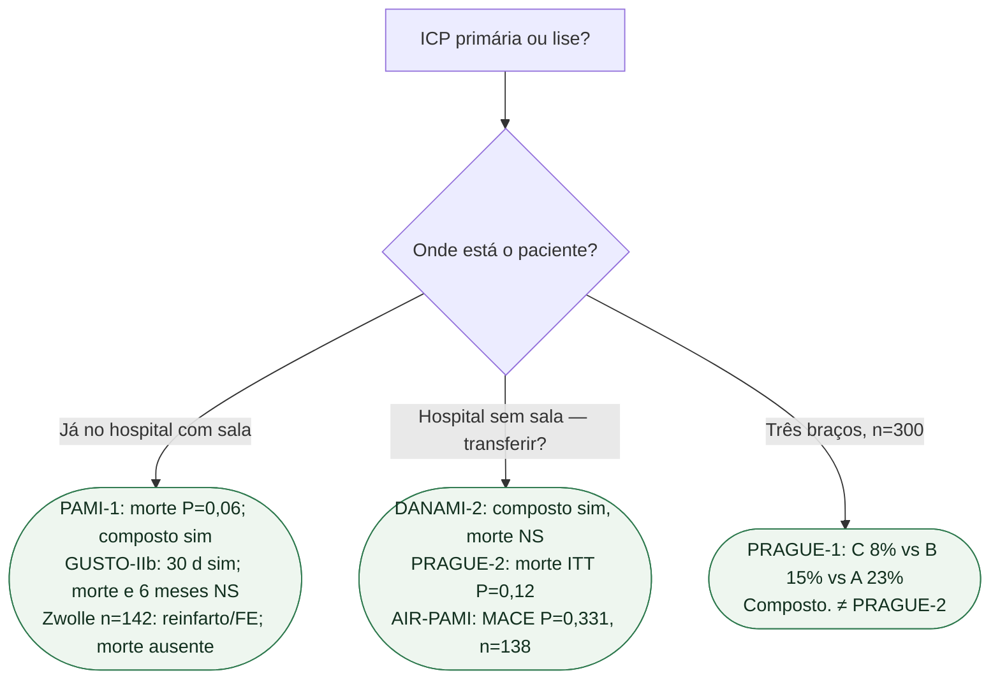

# Fluxograma: ICP primária contra lise

```mermaid
flowchart TD
  R0["ICP primária ou lise?"] --> D1{"Onde está o paciente?"}

  D1 -->|"Já no hospital com sala"| C1(["PAMI-1: morte P=0,06; composto sim<br/>GUSTO-IIb: 30 d sim; morte e 6 meses NS<br/>Zwolle n=142: reinfarto/FE; morte ausente"])

  D1 -->|"Hospital sem sala — transferir?"| C2(["DANAMI-2: composto sim, morte NS<br/>PRAGUE-2: morte ITT P=0,12<br/>AIR-PAMI: MACE P=0,331, n=138"])

  D1 -->|"Três braços, n=300"| C3(["PRAGUE-1: C 8% vs B 15% vs A 23%<br/>Composto. ≠ PRAGUE-2"])

  classDef conduta fill:#eef6ef,stroke:#2f7a4f,color:#12301f;
  class C1,C2,C3 conduta;
```

## Mensagem prática

**Mesmo hospital ≠ transferência.** Morte isolada falha em PAMI-1, GUSTO-IIb, AIR-PAMI e PRAGUE-2. Não fundir numeração PRAGUE.
