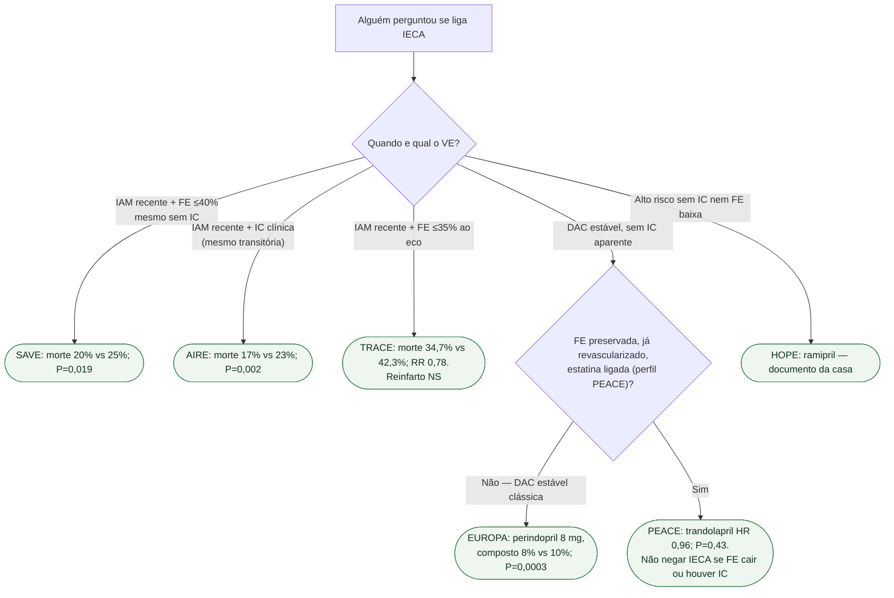

# Fluxograma: IECA após IAM e na DAC estável

## Mensagem prática

**FE baixa ou IC pós-IAM: IECA salva vida.** Na DAC estável com FE normal já 'pronta', o PEACE empata — não o use para desligar o pilar de quem tem disfunção.
