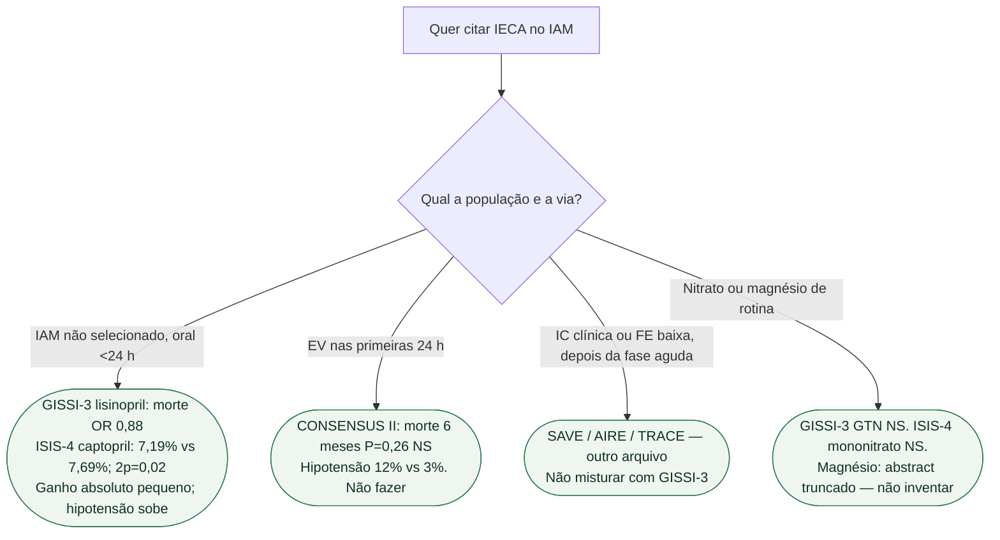

# Fluxograma: qual IECA no IAM?

```mermaid
flowchart TD
  R0["Quer citar IECA no IAM"] --> D1{"Qual a população e a via?"}

  D1 -->|"IAM não selecionado, oral <24 h"| C1(["GISSI-3 lisinopril: morte OR 0,88<br/>ISIS-4 captopril: 7,19% vs 7,69%; 2p=0,02<br/>Ganho absoluto pequeno; hipotensão sobe"])

  D1 -->|"EV nas primeiras 24 h"| C2(["CONSENSUS II: morte 6 meses P=0,26 NS<br/>Hipotensão 12% vs 3%. Não fazer"])

  D1 -->|"IC clínica ou FE baixa, depois da fase aguda"| C3(["SAVE / AIRE / TRACE — outro arquivo<br/>Não misturar com GISSI-3"])

  D1 -->|"Nitrato ou magnésio de rotina"| C4(["GISSI-3 GTN NS. ISIS-4 mononitrato NS.<br/>Magnésio: abstract truncado — não inventar"])

  classDef conduta fill:#eef6ef,stroke:#2f7a4f,color:#12301f;
  class C1,C2,C3,C4 conduta;
```

## Mensagem prática

**Oral precoce no IAM amplo: ganho pequeno. EV imediato: não. IC/FE baixa: SAVE/AIRE/TRACE.**
