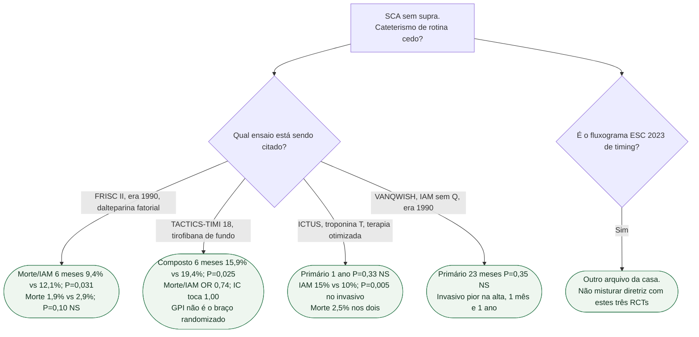

# Fluxograma: invasivo precoce ou seletivo?

## Mensagem prática

**FRISC II e TACTICS sustentam invasivo precoce na sua era; ICTUS mostra que, com troponina e terapia otimizada, o primário empata e o IAM pode subir.** Não colapsar os três num só recado.
