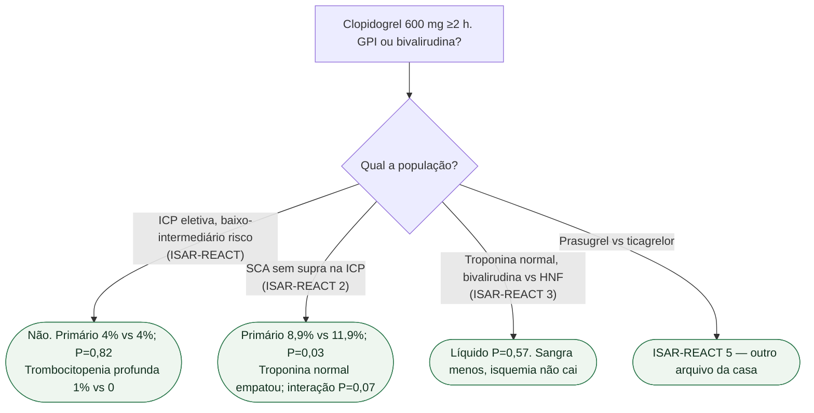

# Fluxograma: qual ISAR-REACT está sendo citado?

```mermaid
flowchart TD
  R0["Clopidogrel 600 mg ≥2 h. GPI ou bivalirudina?"] --> D1{"Qual a população?"}

  D1 -->|"ICP eletiva, baixo-intermediário risco<br/>(ISAR-REACT)"| C1(["Não. Primário 4% vs 4%; P=0,82<br/>Trombocitopenia profunda 1% vs 0"])

  D1 -->|"SCA sem supra na ICP<br/>(ISAR-REACT 2)"| C2(["Primário 8,9% vs 11,9%; P=0,03<br/>Troponina normal empatou; interação P=0,07"])

  D1 -->|"Troponina normal, bivalirudina vs HNF<br/>(ISAR-REACT 3)"| C3(["Líquido P=0,57. Sangra menos, isquemia não cai"])

  D1 -->|"Prasugrel vs ticagrelor"| C4(["ISAR-REACT 5 — outro arquivo da casa"])

  classDef conduta fill:#eef6ef,stroke:#2f7a4f,color:#12301f;
  class C1,C2,C3,C4 conduta;
```

## Mensagem prática

**O número no nome não é a mesma pergunta.** Eletivo NS; SCA mede; bivalirudina empata no líquido.
