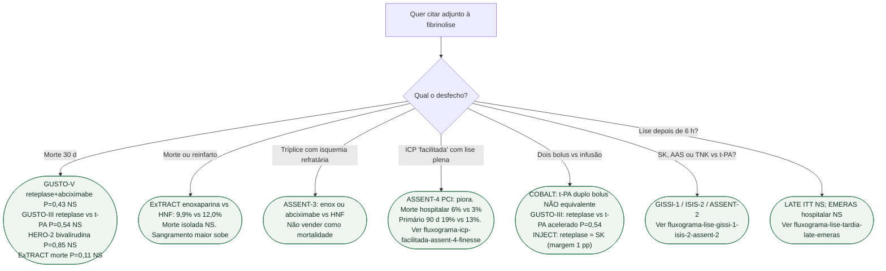

# Fluxograma: o que a lise realmente ganhou

## Mensagem prática

**Abciximabe na lise não reduz morte (GUSTO-V). Reteplase não supera t-PA acelerado (GUSTO-III). Enoxaparina na lise reduz morte/reinfarto (ExTRACT), não morte isolada.**
