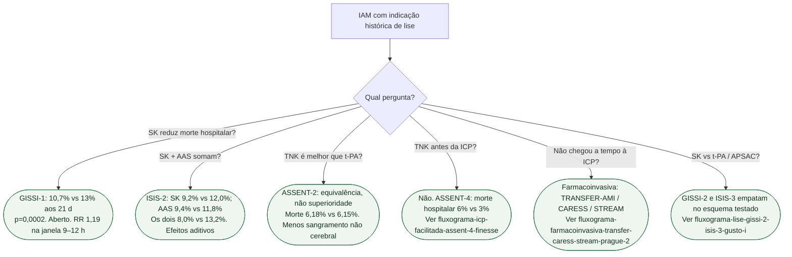

# Fluxograma: o que a lise clássica realmente mostrou

## Mensagem prática

**AAS 160 mg e SK reduziram morte; TNK igualou t-PA.** Facilitar ICP com lise plena fez mal. Quando a ICP atrasa, o ramo é farmacoinvasivo — outro fluxograma.
