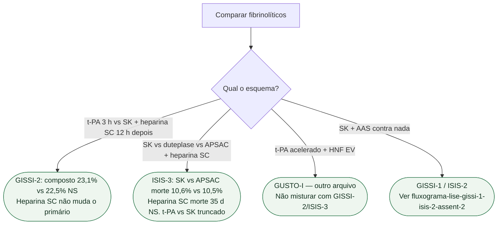

# Fluxograma: SK contra t-PA — qual ensaio, qual esquema

## Mensagem prática

**GISSI-2 e ISIS-3 não mostram superioridade do t-PA no esquema que testaram.** GUSTO-I muda dose, velocidade e heparina. Não fundir os três numa frase só.
