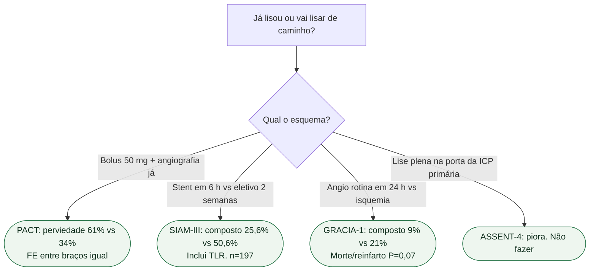

# Fluxograma: lise + cateter — três perguntas diferentes

```mermaid
flowchart TD
  R0["Já lisou ou vai lisar de caminho?"] --> D1{"Qual o esquema?"}

  D1 -->|"Bolus 50 mg + angiografia já"| C1(["PACT: perviedade 61% vs 34%<br/>FE entre braços igual"])

  D1 -->|"Stent em 6 h vs eletivo 2 semanas"| C2(["SIAM-III: composto 25,6% vs 50,6%<br/>Inclui TLR. n=197"])

  D1 -->|"Angio rotina em 24 h vs isquemia"| C3(["GRACIA-1: composto 9% vs 21%<br/>Morte/reinfarto P=0,07"])

  D1 -->|"Lise plena na porta da ICP primária"| C4(["ASSENT-4: piora. Não fazer"])

  classDef conduta fill:#eef6ef,stroke:#2f7a4f,color:#12301f;
  class C1,C2,C3,C4 conduta;
```

## Mensagem prática

**Nenhum desses quatro é o mesmo ensaio.** Perviedade ≠ FE ≠ composto com TLR ≠ morte.
