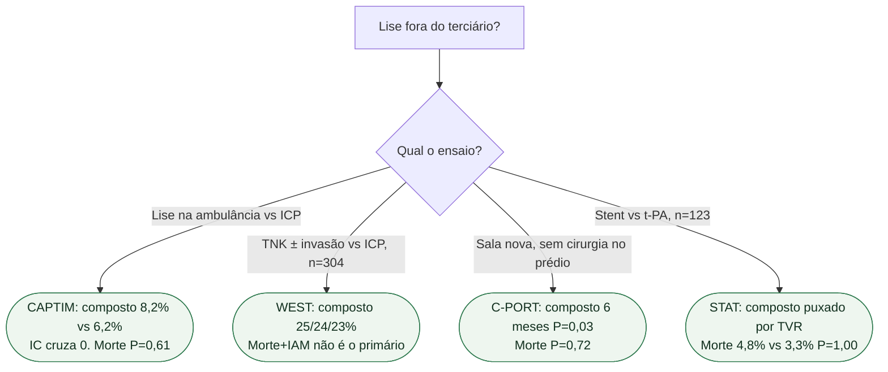

# Fluxograma: lise na rua e sala no hospital comunitário

```mermaid
flowchart TD
  R0["Lise fora do terciário?"] --> D1{"Qual o ensaio?"}

  D1 -->|"Lise na ambulância vs ICP"| C1(["CAPTIM: composto 8,2% vs 6,2%<br/>IC cruza 0. Morte P=0,61"])

  D1 -->|"TNK ± invasão vs ICP, n=304"| C2(["WEST: composto 25/24/23%<br/>Morte+IAM não é o primário"])

  D1 -->|"Sala nova, sem cirurgia no prédio"| C3(["C-PORT: composto 6 meses P=0,03<br/>Morte P=0,72"])

  D1 -->|"Stent vs t-PA, n=123"| C4(["STAT: composto puxado por TVR<br/>Morte 4,8% vs 3,3% P=1,00"])

  classDef conduta fill:#eef6ef,stroke:#2f7a4f,color:#12301f;
  class C1,C2,C3,C4 conduta;
```

## Mensagem prática

**CAPTIM não mostra superioridade da ICP sobre a lise pré-hospitalar.** STAT e WEST não são ensaios de mortalidade.
