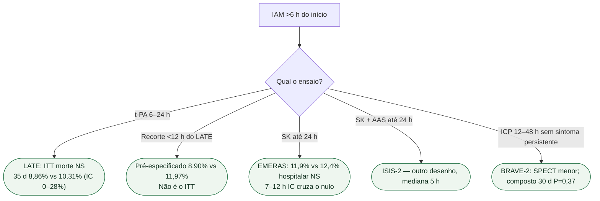

# Fluxograma: lise depois de 6 horas

```mermaid
flowchart TD
  R0["IAM >6 h do início"] --> D1{"Qual o ensaio?"}

  D1 -->|"t-PA 6–24 h"| C1(["LATE: ITT morte NS<br/>35 d 8,86% vs 10,31% (IC 0–28%)"])

  D1 -->|"Recorte <12 h do LATE"| C2(["Pré-especificado 8,90% vs 11,97%<br/>Não é o ITT"])

  D1 -->|"SK até 24 h"| C3(["EMERAS: 11,9% vs 12,4% hospitalar NS<br/>7–12 h IC cruza o nulo"])

  D1 -->|"SK + AAS até 24 h"| C4(["ISIS-2 — outro desenho, mediana 5 h"])

  D1 -->|"ICP 12–48 h sem sintoma persistente"| C5(["BRAVE-2: SPECT menor; composto 30 d P=0,37"])

  classDef conduta fill:#eef6ef,stroke:#2f7a4f,color:#12301f;
  class C1,C2,C3,C4,C5 conduta;
```

## Mensagem prática

**Nem LATE nem EMERAS vencem o ITT de morte.** Não transformar janela <12 h em “lise até 24 h”.
