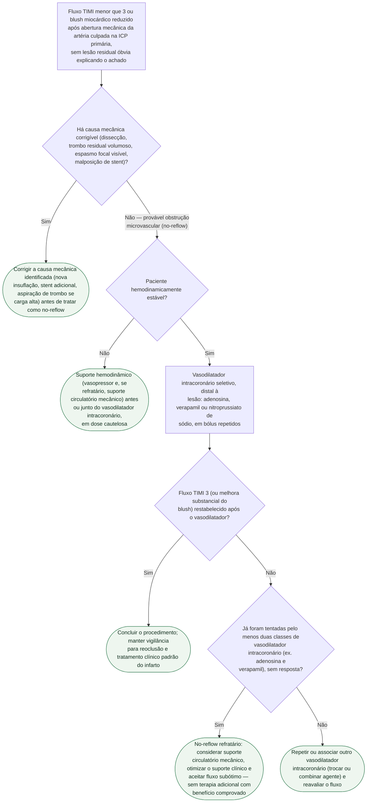

# Fluxograma: Manejo do no-reflow durante a ICP primária

No-reflow é o fluxo coronariano reduzido (TIMI menor que 3) ou a perfusão
miocárdica insuficiente (blush reduzido) **depois** de a artéria culpada já
estar mecanicamente aberta na ICP primária — ou seja, não é falha em abrir a
artéria, é falha da microcirculação distal em receber o fluxo restaurado. O
primeiro passo, sistematicamente esquecido sob pressão de sala, é afastar
causa mecânica corrigível antes de tratar como no-reflow verdadeiro. O
fluxograma abaixo organiza essa sequência.

## Árvore de decisão

## O que a árvore não mostra

**Doses exatas não estão especificadas de propósito.** Adenosina, verapamil e
nitroprussiato de sódio intracoronários têm protocolos de bólus que variam
por instituição e por apresentação farmacêutica disponível — a diretriz e a
literatura de revisão descrevem faixas, não uma dose única e universal.
Consultar o protocolo local antes de administrar.

**Trombectomia por aspiração de rotina não é recomendada, e isso não é uma
omissão.** O ensaio TOTAL, com mais de 10 mil pacientes, mostrou que a
aspiração manual de rotina não reduz desfechos cardiovasculares e aumenta o
risco de acidente vascular cerebral em 30 dias — por isso ela só aparece
dentro de D1, como manobra para trombo residual volumoso identificado, nunca
como profilaxia de no-reflow.

**A prevenção começa antes da abertura da artéria**, e não está representada
aqui: pré-tratamento com vasodilatador em lesões de alta carga trombótica,
escolha entre tromboaspiração seletiva e balão direto, e o próprio tempo de
isquemia total são fatores de risco para no-reflow que atuam antes do ponto
em que esta árvore começa.

**Não há hierarquia comprovada entre adenosina, verapamil e nitroprussiato.**
A escolha costuma depender de disponibilidade e de contraindicação (por
exemplo, bloqueio atrioventricular avançado limita o uso de verapamil) — a
árvore trata as três como intercambiáveis dentro do mesmo passo, o que
reflete a ausência de comparação direta de qualidade na literatura.
