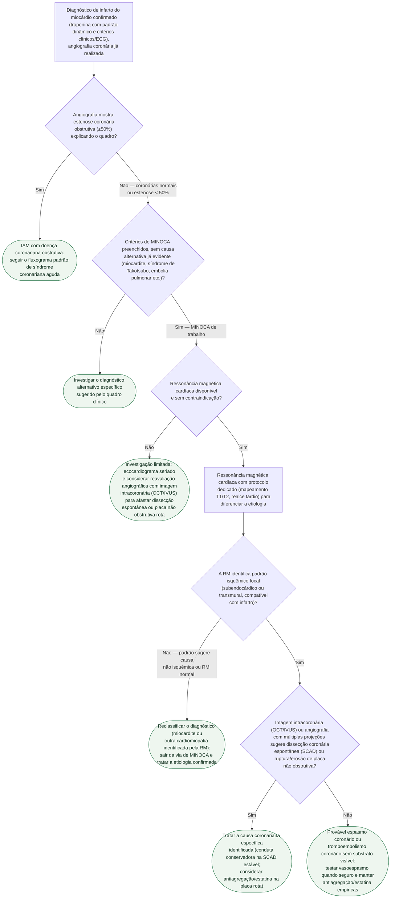

# Fluxograma: MINOCA — investigação diagnóstica

MINOCA (*myocardial infarction with non-obstructive coronary arteries*) é
diagnóstico de trabalho, não diagnóstico final — a diretriz da American
Heart Association é explícita quanto a isso, e a maior armadilha clínica é
parar a investigação no momento em que a angiografia mostra coronárias sem
obstrução significativa. É mais frequente em mulheres do que em homens, e o
documento **"Doença isquêmica na mulher"** desta biblioteca trata da acurácia
diferencial dos testes por sexo; este fluxograma cobre o algoritmo
diagnóstico do MINOCA propriamente dito, a partir do momento em que a
angiografia já foi feita.

## Árvore de decisão

## O que a árvore não mostra

**A prevalência de MINOCA é maior em mulheres, e isso muda o limiar de
suspeita, não o algoritmo.** A diretriz cita prevalência de 5% a 6% dos
infartos, desproporcionalmente maior em mulheres jovens — mas uma vez que o
diagnóstico de trabalho é levantado, a investigação seguinte (RM, imagem
intracoronária) é a mesma para ambos os sexos. A diferença por sexo está na
acurácia de testes de estratificação de risco pré-angiografia, tema do
documento "Doença isquêmica na mulher" desta biblioteca.

**O prognóstico do MINOCA não é benigno**, apesar do nome sugerir isso. A
coorte sueca de Nordenskjöld et al. mostrou taxa relevante de reinfarto no
seguimento — a árvore termina na etiologia, mas o seguimento clínico e a
prevenção secundária continuam sendo necessários mesmo quando nenhuma
obstrução foi encontrada.

**Teste provocativo de vasoespasmo (ergonovina ou acetilcolina intracoronária)
não está detalhado.** É mencionado como opção em C6, mas a técnica exige
experiência do operador e tem contraindicações relativas (espasmo
multivascular grave, disfunção ventricular importante) que não cabem numa
árvore de decisão binária.

**Embolia pulmonar, sepse e crise hipertensiva grave** são exemplos de causa
alternativa que também elevam troponina sem obstrução coronariana — a árvore
as agrupa em C2 porque, uma vez identificadas, a investigação sai
completamente da via cardiológica de MINOCA.