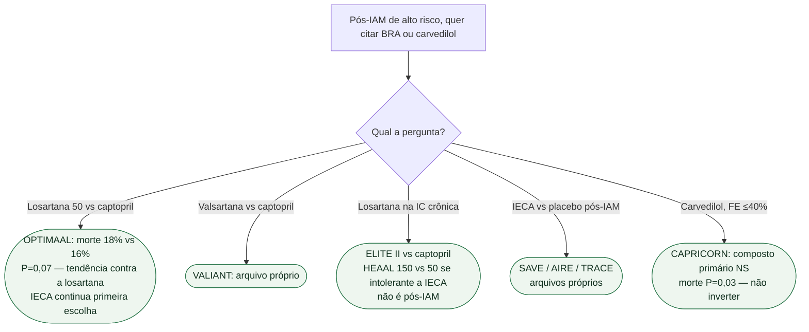

# Fluxograma: trocar o IECA no pós-IAM?

```mermaid
flowchart TD
  R0["Pós-IAM de alto risco, quer citar BRA ou carvedilol"] --> D1{"Qual a pergunta?"}

  D1 -->|"Losartana 50 vs captopril"| C1(["OPTIMAAL: morte 18% vs 16%<br/>P=0,07 — tendência contra a losartana<br/>IECA continua primeira escolha"])

  D1 -->|"Valsartana vs captopril"| C2(["VALIANT: arquivo próprio"])

  D1 -->|"Losartana na IC crônica"| C3(["ELITE II vs captopril<br/>HEAAL 150 vs 50 se intolerante a IECA<br/>não é pós-IAM"])

  D1 -->|"IECA vs placebo pós-IAM"| C4(["SAVE / AIRE / TRACE<br/>arquivos próprios"])

  D1 -->|"Carvedilol, FE ≤40%"| C5(["CAPRICORN: composto primário NS<br/>morte P=0,03 — não inverter"])

  classDef conduta fill:#eef6ef,stroke:#2f7a4f,color:#12301f;
  class C1,C2,C3,C4,C5 conduta;
```

## Mensagem prática

**IECA primeiro no pós-IAM complicado.** Losartana 50 mg no OPTIMAAL não ganha. CAPRICORN não vende o composto.
