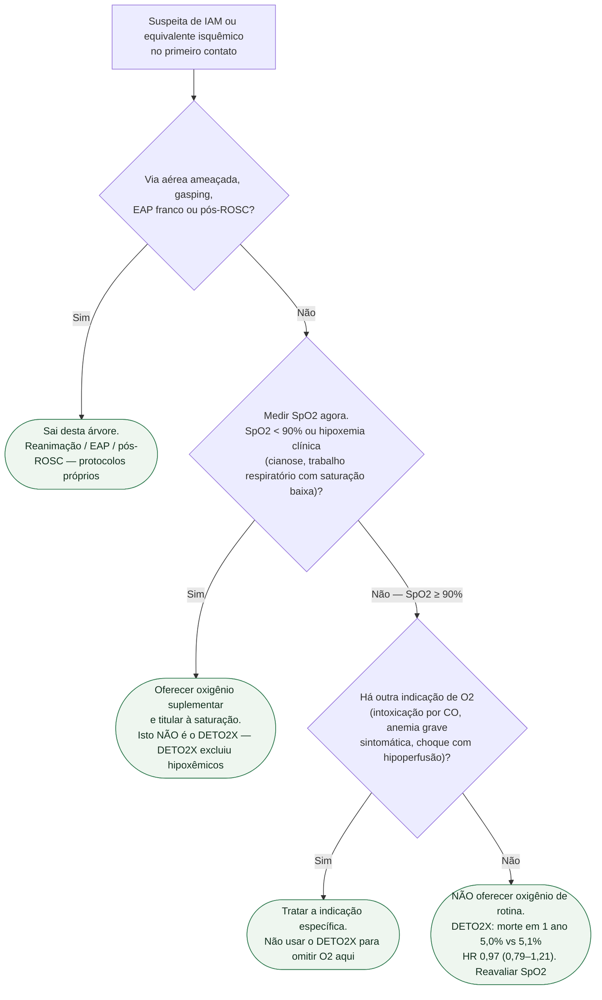

# Fluxograma: oxigênio na suspeita de IAM — só se hipoxemia

Oxigênio deixou de ser item automático do checklist de dor torácica. A árvore abaixo cabe na primeira hora do PS, da SAMU e da UCO. EAP, pós-ROSC e DPOC descompensada **saem** daqui — têm documentos próprios.

## Árvore de decisão

## O que a árvore não mostra

**AVOID não muda o ramo do hipoxêmico.** Sinal de possível dano em desfechos secundários de um ensaio menor de STEMI pré-hospitalar não autoriza deixar o paciente dessaturando.

**Alvo de saturação (94–98% versus 88–92% em risco de hipercapnia) não foi testado no DETO2X.** O ensaio comparou 6 L/min fixos versus ar. Titular faz sentido clínico; não atribuir classe ESC daqui.

**Reavaliar SpO2.** 7,7% dos alocados a ar no DETO2X ficaram hipoxêmicos depois — esses passam para o ramo C1.

## Mensagem prática

**Meça a saturação. Se ≥90% e não há outra indicação, não coloque O2 de rotina. Se <90%, coloque.**
