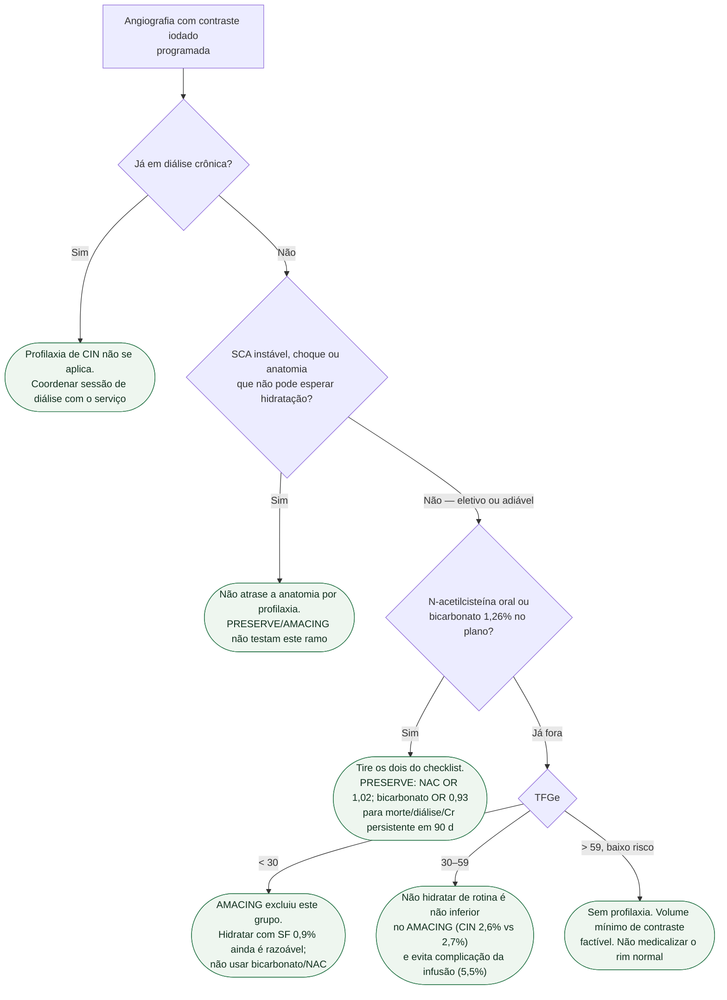

# Fluxograma: profilaxia de nefropatia por contraste antes da angiografia

## O que a árvore não mostra

ISCHEMIA-CKD decide **se** cateterizar o estável com DRC avançada, não como proteger o rim do contraste. São perguntas em sequência: primeiro “precisa da anatomia?”; depois “como não piorar o rim”.

## Mensagem prática

**NAC e bicarbonato: não. Hidratação automática em TFGe 30–59 eletivo: não. TFGe <30: não extrapolar o AMACING.**
