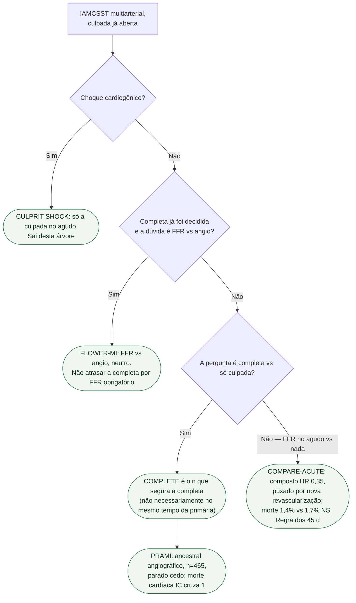

# Fluxograma: revascularização completa no STEMI multiarterial

## Mensagem prática

**Estável, multiarterial: completa (COMPLETE). Choque: só culpada. FFR vs angio na completa: FLOWER-MI. COMPARE não prova redução de morte.**
