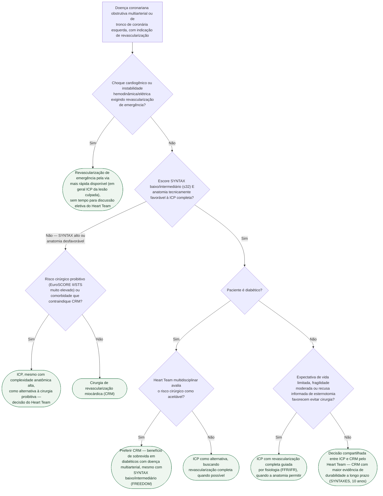

# Fluxograma: Revascularização percutânea versus cirúrgica na doença multiarterial e de tronco

A pergunta "ICP ou CRM?" na doença multiarterial ou de tronco de coronária
esquerda não tem resposta única — a diretriz ESC/EACTS 2018 organiza a
decisão em torno de quatro eixos que se combinam: **complexidade anatômica**
(escore SYNTAX), **risco cirúrgico**, **presença de diabetes** e
**expectativa de vida/preferência do paciente**, sempre discutidos pelo
Heart Team. O fluxograma abaixo não substitui essa discussão — organiza a
sequência lógica dos eixos que a alimentam.

## Árvore de decisão

## O que a árvore não mostra

**O escore SYNTAX não é recalculado aqui.** A árvore assume que ele já foi
calculado (número de lesões, localização, complexidade de bifurcação,
calcificação, tortuosidade) antes de entrar em D2. O ponto de corte de 32 é o
da diretriz ESC/EACTS 2018; ele separa "baixo/intermediário" de "alto", mas
não substitui a avaliação qualitativa da anatomia (uma lesão tecnicamente
difícil pode existir mesmo com SYNTAX numericamente baixo).

**O benefício de sobrevida da CRM no diabético vem do FREEDOM, um ensaio de
2012 com stents farmacológicos de 1ª geração.** A magnitude do benefício em
relação à ICP com stents atuais (com plataformas e antiproliferativos mais
novos) é objeto de debate — a diretriz mantém a recomendação, mas isso não é
equivalente a repetir o ensaio com a tecnologia de hoje.

**Risco cirúrgico não é um número único.** EuroSCORE II e STS são as
ferramentas mais citadas, mas nenhuma delas incorpora bem fragilidade,
calcificação de aorta ou disfunção cognitiva — fatores que o Heart Team pesa
clinicamente e que a árvore resume na pergunta de D3 e D6.

**Revascularização completa versus só a lesão culpada** (no contexto de
infarto multiarterial) é uma pergunta distinta desta árvore, tratada em
documento próprio da biblioteca — aqui o cenário é eletivo ou subagudo, não
STEMI com múltiplas lesões na fase aguda.
