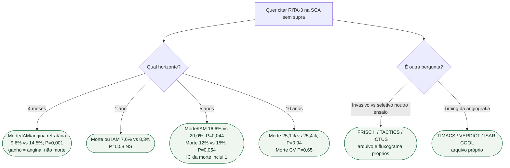

# Fluxograma: o que o RITA-3 realmente mostrou

```mermaid
flowchart TD
  R0["Quer citar RITA-3 na SCA sem supra"] --> D1{"Qual horizonte?"}

  D1 -->|"4 meses"| C1(["Morte/IAM/angina refratária<br/>9,6% vs 14,5%; P=0,001<br/>ganho = angina, não morte"])

  D1 -->|"1 ano"| C2(["Morte ou IAM 7,6% vs 8,3%<br/>P=0,58 NS"])

  D1 -->|"5 anos"| C3(["Morte/IAM 16,6% vs 20,0%; P=0,044<br/>Morte 12% vs 15%; P=0,054<br/>IC da morte inclui 1"])

  D1 -->|"10 anos"| C4(["Morte 25,1% vs 25,4%; P=0,94<br/>Morte CV P=0,65"])

  R0 --> D2{"É outra pergunta?"}

  D2 -->|"Invasivo vs seletivo noutro ensaio"| C5(["FRISC II / TACTICS / ICTUS<br/>arquivo e fluxograma próprios"])
  D2 -->|"Timing da angiografia"| C6(["TIMACS / VERDICT / ISAR-COOL<br/>arquivo próprio"])

  classDef conduta fill:#eef6ef,stroke:#2f7a4f,color:#12301f;
  class C1,C2,C3,C4,C5,C6 conduta;
```

## Mensagem prática

**4 meses = angina; 1 ano NS; 5 anos composto limiar; 10 anos morte empata.** Não vender mortalidade.
