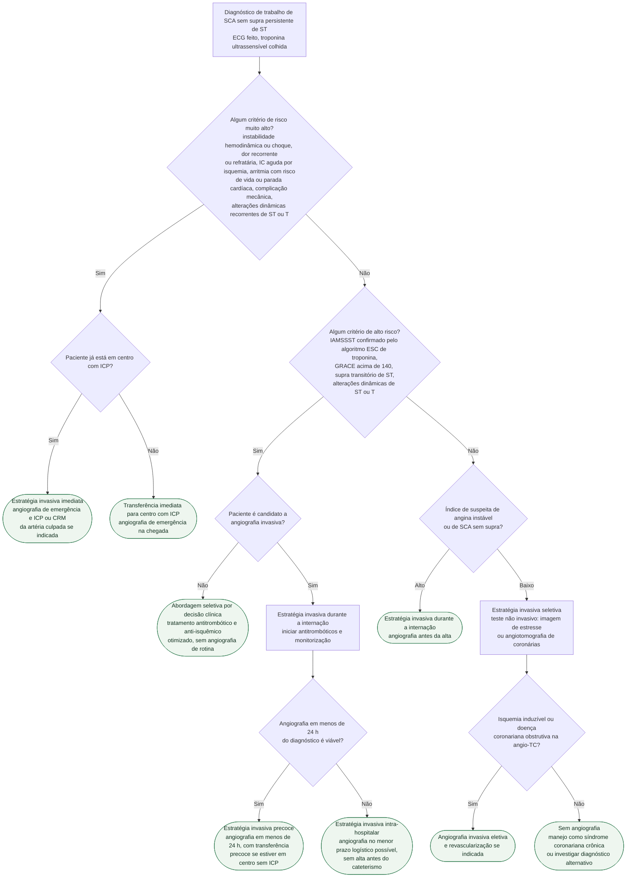

# Fluxograma: SCA sem supra de ST — timing da estratégia invasiva (ESC 2023)

Na SCA sem supra de ST, o exame, o cateterismo e os fármacos são praticamente os mesmos
para todos os pacientes; o que a diretriz ESC 2023 decide, de fato, é **quando** levar cada
um à hemodinâmica. O fluxograma geral já publicado nesta pasta
(fluxograma-sindrome-coronariana-aguda-esc-2023) separa STEMI de NSTE-ACS e aplica o
algoritmo 0h/1h de troponina. Este aprofunda apenas o passo seguinte: com o diagnóstico de
trabalho de NSTE-ACS estabelecido, escolher entre estratégia invasiva **imediata**,
**precoce em menos de 24 h** e **seletiva** — e, no ramo seletivo, o que decide se a
angiografia acontece ou não.

A diretriz define as três estratégias na sua Tabela 3: invasiva imediata é angiografia de
emergência, "o mais rápido possível", com ICP ou cirurgia da artéria culpada se indicada;
invasiva precoce é angiografia em menos de 24 h do diagnóstico de SCA; invasiva seletiva é
angiografia decidida por avaliação clínica e/ou teste não invasivo.

## Árvore de decisão

O que vale para todos os ramos e ficou fora do diagrama: terapia antitrombótica e anti-isquêmica desde o diagnóstico de trabalho, ecocardiograma de emergência em quem chega em choque ou com suspeita de complicação mecânica (Classe I, nível C) e reavaliação contínua — paciente do ramo seletivo que volta a ter dor ou muda o ECG sobe de ramo.

## Ramo 1 — risco muito alto: invasiva imediata

Basta **um** critério. A Recommendation Table 4 lista: instabilidade hemodinâmica ou choque cardiogênico; dor torácica recorrente ou refratária apesar do tratamento clínico; arritmia intra-hospitalar com risco de vida; complicação mecânica do infarto; insuficiência cardíaca aguda presumidamente secundária a isquemia em curso; alterações dinâmicas recorrentes de ST ou onda T, particularmente com supra intermitente. O texto da seção 5.2.2 acrescenta parada cardíaca após a apresentação. A recomendação é **Classe I, nível C**.

O ponto que mais confunde: a diretriz 2023 não fixa número de horas para "imediata" — define-a como angiografia de emergência, "o mais rápido possível". O prazo de **menos de 2 horas**, que o documento derivado deste acervo mantém, não consta na Tabela 3 nem na Recommendation Table 4 de 2023 — o número vem da diretriz ESC 2020 de SCA sem supra de ST (Collet et al., Eur Heart J 2021;42(14):1289-1367), cuja seção 6.1.2.1 se intitula "Immediate invasive strategy (<2 h)", e o endosso da NVVC de 2024 ainda o usa como título de seção; a ESC 2023 substituiu o prazo por "de emergência, o mais rápido possível". Na Figura 8, quem está em centro sem ICP com critério de risco muito alto é **transferido imediatamente**; a nota da Figura 4 acrescenta que o resultado da troponina não é necessário para essa triagem inicial e não deve atrasá-la. O choque cardiogênico tem manejo próprio — ver choque-cardiogenico-na-sindrome-coronariana-aguda-culprit-shock-e-iabp-shock-ii.

## Ramo 2 — alto risco: invasiva na internação, precoce se possível

Também basta um critério. O que mudou em 2023 é a força da recomendação sobre o prazo:

| Recomendação | ESC 2020 | ESC 2023 |
|---|---|---|
| Estratégia invasiva durante a internação em alto risco ou alta suspeita de angina instável | — | Classe I, nível A |
| Estratégia invasiva precoce, em menos de 24 h, em alto risco | Classe I, nível A ("é recomendada") | Classe IIa, nível A ("deve ser considerada") |

Os quatro critérios de alto risco de 2023: diagnóstico confirmado de IAMSSST pelos algoritmos ESC de troponina ultrassensível; alterações dinâmicas de ST ou onda T; supra transitório de ST; **GRACE acima de 140**. A conduta obrigatória é a angiografia antes da alta; as 24 h são o alvo a perseguir, não o gatilho de uma conduta diferente. Por isso a árvore separa "viável em menos de 24 h" (ramo precoce, com transferência precoce a partir de centro sem ICP) de "não viável" (invasiva intra-hospitalar no menor prazo). O grupo de trabalho holandês que endossou a diretriz registra que, quando as 24 h não são possíveis por logística, angiografia em até 72 h é aceitável — posição da NVVC, não da ESC.

A diretriz explica a redução de classe: nas metanálises de ensaios que compararam angiografia precoce e tardia, nenhuma mostrou superioridade da estratégia precoce para morte ou infarto não fatal; o ganho consistente foi menos isquemia recorrente ou refratária e internação mais curta. Na metanálise de dados individuais houve benefício de sobrevida no subgrupo com **GRACE acima de 140** e no subgrupo com troponina positiva, com testes de interação inconclusivos. Jobs, Collet e Thiele, atualizando esses dados, resumem: GRACE acima de 140 continua sendo o único critério de estratégia precoce com evidência científica direta, e nenhum ensaio de timing usou o algoritmo 0h/1h para definir IAMSSST.

## Quem não é candidato à angiografia

A seção 5.2.3 admite abordagem seletiva também para paciente com IAMSSST ou angina instável que não seja bom candidato a angiografia. Esse é o ramo C3: tratamento clínico otimizado, com angiografia só se o quadro mudar. O detalhamento está no material suplementar da diretriz (seção 5.2.1), não lido nesta sessão.

## Ramo 3 — sem critério de risco: a suspeita clínica decide

Sem critério de risco muito alto nem de alto risco, o paciente é, em geral, alguém com troponina não elevada, ou elevada sem preencher critério de infarto. A diretriz divide esse grupo pelo **índice de suspeita**: alta suspeita de angina instável leva a estratégia invasiva durante a internação (Classe I, nível A); baixa suspeita de SCA sem supra leva a **estratégia invasiva seletiva** (Classe I, nível A), com angiografia condicionada a teste de isquemia apropriado ou à detecção de doença obstrutiva na angiotomografia.

Base dos ensaios de rotina versus seletiva, segundo a diretriz: a estratégia invasiva de rotina não reduziu mortalidade total no conjunto dos pacientes com NSTE-ACS, mas reduziu desfechos isquêmicos compostos, sobretudo nos de alto risco, ao custo de mais complicação periprocedimento e sangramento — e a maior parte desses ensaios é anterior ao acesso radial, aos stents farmacológicos atuais e à troponina ultrassensível.

## O teste não invasivo no ramo seletivo

| Situação | Conduta ESC 2023 | Classe, nível |
|---|---|---|
| Suspeita de SCA, troponina ultrassensível não elevada ou incerta, ECG sem alteração, sem recorrência de dor | Incorporar angio-TC de coronárias ou imagem de estresse não invasiva ao workup inicial | IIa, A |
| Angio-TC precoce de rotina em toda suspeita de SCA | Não recomendada | III, B |
| Escores de risco estabelecidos, como o GRACE, para estimativa de prognóstico | Devem ser considerados | IIa, B |

A angio-TC como primeira linha para todos não melhorou desfecho em 1 ano no RAPID-CTCA e prolongou a internação — daí a Classe III para o uso rotineiro. Quem sai do ramo seletivo sem isquemia e sem doença obstrutiva passa a ser manejado como síndrome coronariana crônica (ver fluxograma-sindrome-coronariana-cronica-esc-2024) ou recebe investigação de diagnóstico alternativo.

## Entradas do GRACE

GRACE acima de 140 é um dos quatro critérios de alto risco, mas as variáveis do escore não são ramos da árvore. As oito entradas — idade, frequência cardíaca, pressão sistólica, creatinina, classe Killip, parada cardíaca na admissão, desvio de ST e elevação de marcador de necrose —, seus pesos e as faixas de mortalidade intra-hospitalar estão em sindrome-coronariana-aguda-estratificacao-de-risco-grace-complemento-numerico. A própria diretriz observa que faltam estudos do valor do corte de 140 na era da troponina ultrassensível.

## Limitações e o que confirmar

- O prazo de "menos de 2 horas" para a estratégia imediata não está na tabela de recomendação de 2023, que diz apenas "de emergência, o mais rápido possível"; ele vem da diretriz ESC 2020 de SCA sem supra (seção 6.1.2.1) e o documento derivado deste acervo (sindrome-coronariana-aguda-timing-invasivo-e-dapt-esc-2023) mantém o número sem indicar essa origem — VERIFICAÇÃO HUMANA NECESSÁRIA para harmonizar os dois textos.
- A diretriz não define operacionalmente "alto" e "baixo índice de suspeita" de angina instável; o ramo D6 é julgamento clínico, sem escore.
- O ramo "não candidato à angiografia" segue o texto principal; o detalhe está no material suplementar, não lido nesta sessão.
- A janela de 72 h no ramo de alto risco sem viabilidade de 24 h é posição do endosso holandês (NVVC), não recomendação da ESC.
- Da metanálise de Jobs, Collet e Thiele foi lida apenas a síntese; nenhum hazard ratio foi reproduzido aqui por isso.

## Tudo com Tudo

- [Fluxograma: Síndrome Coronariana Aguda — do primeiro contato à reperfusão (ESC 2023)](/biblioteca/fluxograma-sindrome-coronariana-aguda-esc-2023)
- [Síndrome Coronariana Aguda — Timing da Estratégia Invasiva e Duração de DAPT (ESC 2023)](/biblioteca/sindrome-coronariana-aguda-timing-invasivo-e-dapt-esc-2023)
- [Síndrome Coronariana Aguda: Estratificação de Risco GRACE (Complemento Numérico)](/biblioteca/sindrome-coronariana-aguda-estratificacao-de-risco-grace-complemento-numerico)
- [Síndrome Coronariana Aguda: Diagnóstico e Manejo (ESC 2023)](/biblioteca/sindrome-coronariana-aguda-diagnostico-e-manejo-esc-2023)
- [Choque Cardiogênico na Síndrome Coronariana Aguda: CULPRIT-SHOCK e IABP-SHOCK II](/biblioteca/choque-cardiogenico-na-sindrome-coronariana-aguda-culprit-shock-e-iabp-shock-ii)
- [Fluxograma: Síndrome coronariana crônica — investigação da dor torácica (ESC 2024)](/biblioteca/fluxograma-sindrome-coronariana-cronica-esc-2024)
