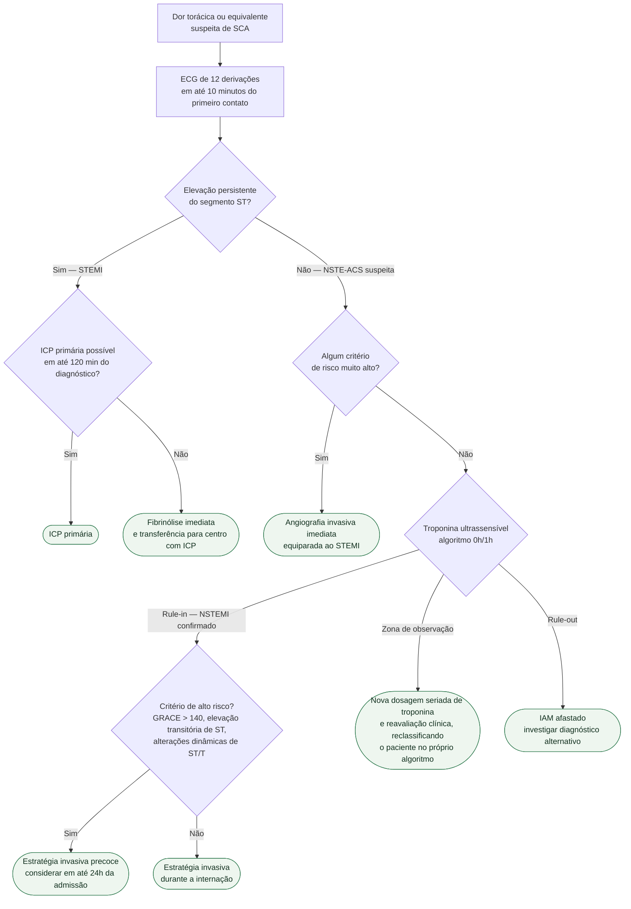

# Fluxograma: Síndrome Coronariana Aguda (ESC 2023)

A diretriz ESC 2023 unificou, pela primeira vez, STEMI e SCA sem elevação de ST
(NSTE-ACS) em um único documento. Testes diagnósticos e tratamento farmacológico
são praticamente os mesmos ao longo do espectro — **o que separa as formas de
apresentação é o tempo até a angiografia coronariana invasiva**. O fluxograma
abaixo é organizado em torno dessa decisão.

## Árvore de decisão

## Critérios de risco muito alto

Presente qualquer um deles, a angiografia invasiva é imediata, sem esperar
resultado de troponina:

- instabilidade hemodinâmica ou choque cardiogênico
- dor torácica recorrente ou persistente, refratária ao tratamento clínico
- insuficiência cardíaca aguda presumidamente secundária a isquemia em curso
- arritmia ameaçadora à vida ou parada cardíaca após a apresentação
- complicação mecânica
- alterações eletrocardiográficas dinâmicas recorrentes sugestivas de isquemia

## Observações sobre o uso do algoritmo 0h/1h

O algoritmo 0h/1h classifica o paciente em três faixas — *rule-out*, zona de
observação e *rule-in*. Os pontos de corte numéricos **dependem do ensaio de
troponina usado no laboratório**: não são intercambiáveis entre fabricantes, e
por isso não são reproduzidos aqui. Consulte os valores validados para o ensaio
da sua instituição.

A faixa de *rule-out* tem mortalidade e incidência de IAM cumulativas baixas em
30 dias, o que sustenta a alta segura a partir dela quando o quadro clínico
acompanha.

## Por que o tempo é a variável central

No STEMI, a reperfusão por ICP primária deve ocorrer em até 120 minutos do
diagnóstico; ultrapassado esse limite previsto, a fibrinólise imediata seguida
de transferência é a estratégia recomendada. No NSTE-ACS, a presença de critério
de risco muito alto aproxima o manejo do STEMI, com angiografia imediata.
