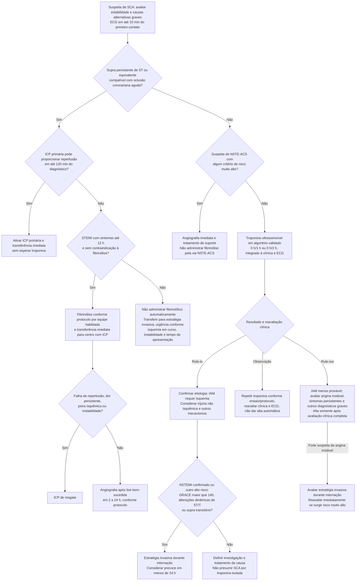

# Fluxograma: Síndrome Coronariana Aguda (ESC 2023)

A apresentação clínica, o ECG, o tempo de sintomas, a estabilidade e as contraindicações definem a estratégia. **Angiografia imediata não significa fibrinólise para toda SCA.** Troponina elevada identifica injúria miocárdica; confirmar IAM exige integração com evidência de isquemia e avaliação da causa. As expressões STEMI/NSTEMI abaixo descrevem as vias operacionais da diretriz de SCA de 2023.

## Árvore de decisão

## Como interpretar os caminhos

No STEMI, o limite de 120 minutos é a previsão do diagnóstico até a reperfusão por ICP, não uma autorização para esperar. A fibrinólise depende de início dos sintomas em até 12 horas e ausência de contraindicações; sangramento e diagnósticos alternativos, incluindo dissecção de aorta, precisam ser considerados pelo protocolo. Após 12 horas, ou quando a lise é contraindicada, priorizar a estratégia invasiva conforme apresentação. Isquemia persistente, instabilidade ou arritmia ameaçadora à vida exige resposta imediata. A via farmacoinvasiva inclui transferência sem esperar provar sucesso da lise; falha de reperfusão ou deterioração indica resgate.

Na NSTE-ACS, risco muito alto inclui choque/instabilidade, dor persistente ou recorrente refratária, insuficiência cardíaca aguda atribuível a isquemia em curso, arritmia ameaçadora à vida, complicação mecânica e alterações recorrentes dinâmicas de ST/T, especialmente supra intermitente. Esses achados justificam angiografia imediata. **Não autorizam fibrinólise.** Parada recuperada sem supra não gera, isoladamente, angiografia imediata universal em paciente estável.

**NSTEMI confirmado já é critério de alto risco**, sem exigir GRACE >140 adicional. A diretriz recomenda estratégia invasiva durante a internação em alto risco e orienta considerar a realização em menos de 24 horas; a via imediata fica reservada ao risco muito alto. Angina instável com forte suspeita clínica também exige avaliação da estratégia invasiva, mesmo com troponina negativa.

Os limiares dos algoritmos rápidos dependem do ensaio laboratorial e não são intercambiáveis. *Rule-in* não prova infarto por trombose coronariana e *rule-out* não exclui angina instável, TEP, doença aórtica ou outras emergências. Sintomas persistentes, apresentação muito precoce, mudanças no ECG ou incoerência clínica exigem reavaliação; não usar o resultado isolado para alta.

Fonte primária: [ESC 2023 — SCA, texto integral, Recommendation Table 4 e seções 5.1–5.3](https://repisalud.isciii.es/bitstream/20.500.12105/16578/1/2023%20ESC%20Guidelines_Eur%20Heart%20J_2023.pdf). O repositório institucional hospeda o artigo original; as decisões acima não transformam a classificação bioquímica em indicação automática de reperfusão.
