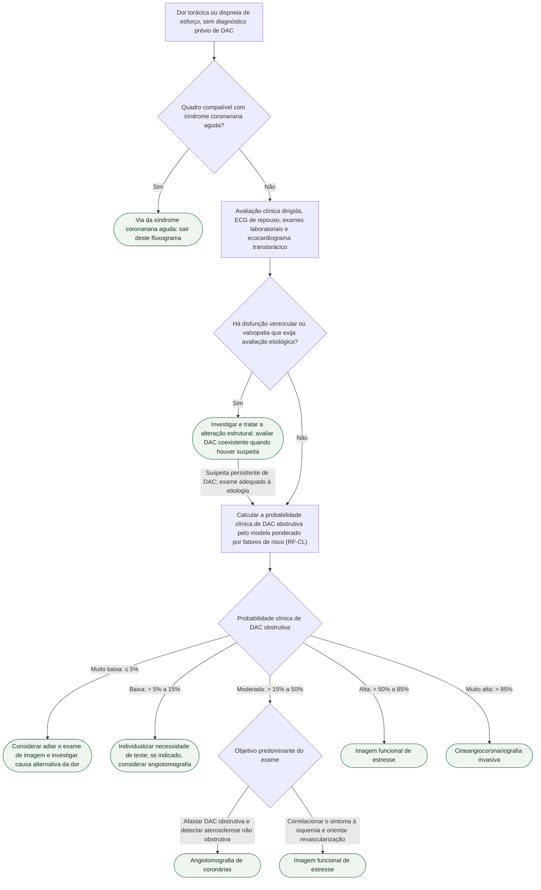

# Fluxograma: Síndrome coronariana crônica — investigação da dor torácica (ESC 2024)

A mudança de 2024 não está no tratamento: está em **quem entra na fila de exame**.
A diretriz passa a recomendar o cálculo da probabilidade clínica pelo modelo
**ponderado por fatores de risco (RF-CL)** e cria uma faixa de probabilidade
**muito baixa (≤ 5%)** em que a conduta recomendada é **considerar adiar o exame**
— e não pedir angiotomografia "por segurança". Com o modelo antigo, de idade,
sexo e sintoma apenas, cerca de 19% dos avaliados caíam na faixa de probabilidade
muito baixa; com o modelo ponderado por fatores de risco, cerca de metade.

A árvore abaixo é a via do paciente **estável**. Suspeita de síndrome coronariana
aguda sai daqui na primeira bifurcação e segue o fluxograma próprio.

## Árvore de decisão

Duas condutas aparecem duplicadas na árvore de propósito: a angiotomografia é
recomendada tanto na faixa baixa quanto na moderada, e a imagem funcional tanto
na moderada quanto na alta. É consequência de as duas recomendações da diretriz
se **sobreporem** na faixa moderada — angiotomografia para probabilidade baixa
ou moderada, imagem funcional para probabilidade moderada ou alta. Entre 15% e
50%, portanto, os dois exames são recomendados, e o que decide é o objetivo, não
a probabilidade. Nas demais faixas, a escolha também deve considerar características
do paciente, qualidade esperada do exame, experiência local e disponibilidade;
as faixas não tornam um único método obrigatório. Na probabilidade baixa,
a necessidade de investigação adicional deve ser individualizada.

## O que entra no modelo ponderado por fatores de risco

O RF-CL parte da probabilidade pré-teste clássica — **idade, sexo e
característica do sintoma** — e acrescenta **cinco fatores de risco**:

1. história familiar de doença arterial coronariana;
2. tabagismo;
3. dislipidemia;
4. hipertensão arterial;
5. diabetes melito.

Quando houver **escore de cálcio coronariano** disponível, ele pode ser
incorporado ao cálculo, refinando ainda mais a classificação (modelo CACS-CL).

Esses itens são **entradas de um mesmo cálculo**, não bifurcações: por isso estão
aqui, e não como ramos da árvore.

## Por que a faixa muito baixa mudou a prática

A recomendação de **considerar adiar o exame** quando a probabilidade é ≤ 5% não
é economia de recurso: é evitar o achado incidental que gera nova investigação,
nova ansiedade e nova exposição, num paciente cuja chance de doença obstrutiva já
era desprezível antes de qualquer imagem. O ganho do modelo ponderado é
justamente **reclassificar mais gente para baixo** — para as faixas muito baixa e
baixa —, e não descobrir mais doentes.

## Quando a coronariografia invasiva é o primeiro exame

Além da probabilidade clínica **muito alta (> 85%)**, a diretriz recomenda a
cineangiocoronariografia como caminho direto quando há **sintoma grave refratário
ao tratamento otimizado**, **angina a baixo nível de esforço** e/ou **alto risco
de eventos**. Nesses casos o exame não é feito para saber se há doença: é feito
porque a conduta seguinte provavelmente será revascularização.

## O que a árvore não mostra

**Ecocardiograma de repouso é passo obrigatório**, não opcional: entra antes do
cálculo da probabilidade porque disfunção ventricular e valvopatia mudam tanto o
diagnóstico quanto a conduta, e nenhum modelo de probabilidade de DAC obstrutiva
as detecta.

**Probabilidade pós-teste também conta.** A recomendação de coronariografia vale
para probabilidade clínica **pré ou pós-teste** muito alta — ou seja, um exame não
invasivo fortemente positivo desloca o paciente para avaliação invasiva, conforme risco e contexto, mesmo que a
probabilidade pré-teste fosse moderada. A árvore representa a entrada; a
reavaliação após o resultado é um segundo ciclo da mesma lógica.

**Angina com coronárias sem obstrução (ANOCA/INOCA)** é diagnóstico da mesma via,
não uma exceção: quando o exame anatômico afasta obstrução e o sintoma persiste,
a investigação segue para disfunção microvascular e vasoespasmo, tema tratado em
documento próprio da biblioteca.

## Complemento clínico e fonte da individualização

A página oficial ESC 2024 descreve que as categorias muito baixa e baixa podem
não necessitar de exames adicionais. A síntese institucional ACC explicita que
a seleção do teste considera características do paciente, desempenho esperado,
experiência local e disponibilidade. Assim, a árvore não deve ser aplicada como
um comando automático de angiotomografia em toda probabilidade >5–15%.

- [ESC 2024: portal oficial](https://www.escardio.org/guidelines/clinical-practice-guidelines/all-esc-practice-guidelines/chronic-coronary-syndromes/).
- [ACC: síntese institucional, item 4](https://www.acc.org/latest-in-cardiology/ten-points-to-remember/2024/09/01/15/01/2024-esc-guidelines-for-ccs-esc-2024).
- [Primeira consulta: do sintoma à decisão](/biblioteca/suspeita-de-doenca-coronariana-primeira-consulta-do-sintoma-a-decisao).

## Recursos relacionados no CorVIA

- [Suspeita de doença coronariana: primeira consulta, do sintoma à decisão](/biblioteca/suspeita-de-doenca-coronariana-primeira-consulta-do-sintoma-a-decisao)
- [Dor torácica com exames discordantes: reavaliação e destino seguro](/biblioteca/dor-toracica-exames-discordantes-reavaliacao-e-destino-seguro)
- [Primeiro retorno após SCA: conciliação antitrombótica e intercorrências](/biblioteca/primeiro-retorno-pos-sca-conciliacao-antitrombotica-e-intercorrencias)
- [Síndrome coronariana crônica](/doencas/sindrome-coronariana-cronica)
- [HEART](/calculadoras/heart)
- [GRACE](/calculadoras/grace)
- [alta pos sindrome coronariana aguda](/checklists/alta-pos-sindrome-coronariana-aguda)
- [Angiotomografia computadorizada de coronárias (angio-TC de coronárias, CCTA)](/exames/angiotomografia-de-coronarias)
- [Troponina de alta sensibilidade (hs-cTn)](/exames/troponina-de-alta-sensibilidade)
- [acido acetilsalicilico aas](/medicamentos?slug=acido-acetilsalicilico-aas)
- [atorvastatina calcica](/medicamentos?slug=atorvastatina-calcica)
- [Doença coronariana: da dor torácica ao primeiro retorno após SCA](/trilhas/trilha-consulta-progressiva-doenca-coronariana)

Os recursos de exames e tratamentos devem ser usados conforme a indicação e o contexto descritos; sua presença nesta sequência não indica solicitação ou prescrição automática.
