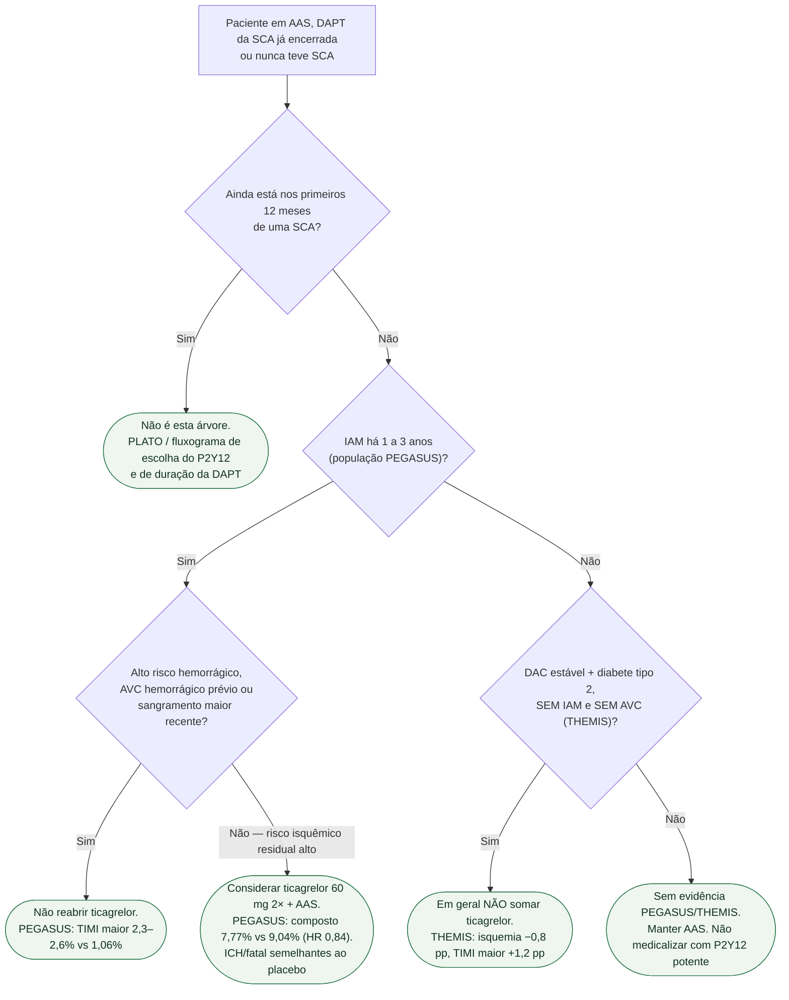

# Fluxograma: ticagrelor além de 12 meses — PEGASUS ou THEMIS?

## Mensagem prática

**IAM há 1–3 anos + baixo sangramento: PEGASUS pode reabrir o ticagrelor. Diabete estável sem IAM: THEMIS, em geral não.** Os 12 meses da SCA já foram o PLATO.
