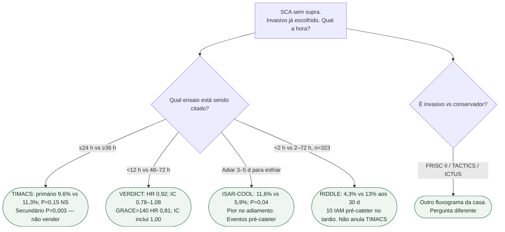

# Fluxograma: quando cateterizar, uma vez decidido o invasivo

## Mensagem prática

**Decidido o invasivo, TIMACS e VERDICT não mostram que muito precoce ganha o primário.** Adiar dias para “esfriar” (ISAR-COOL) piora. RIDDLE é pequeno e não reescreve os dois grandes.
