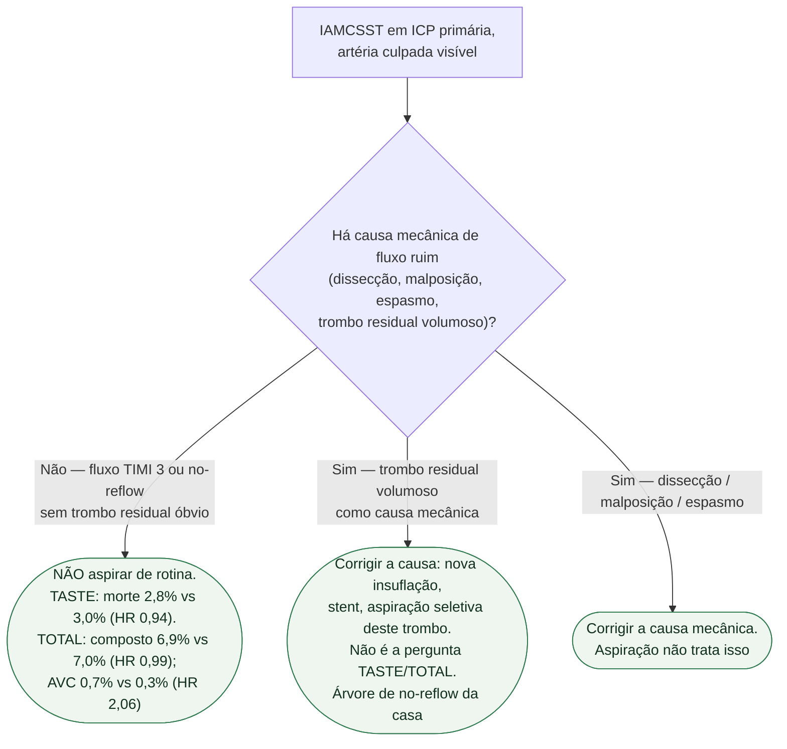

# Fluxograma: tromboaspiração na ICP primária

## Mensagem prática

**Rotina: não. Resgate de trombo residual volumoso: outra árvore (no-reflow mecânico).** O TOTAL não autoriza aspirar “para ver se o blush melhora”.
