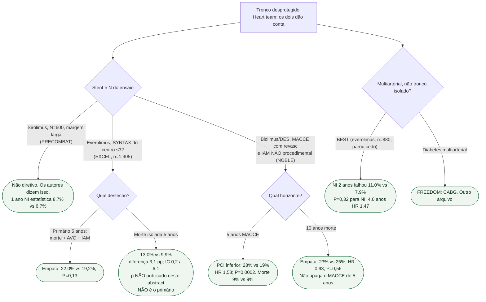

# Fluxograma: tronco — qual ensaio responde o quê

## Mensagem prática

**EXCEL e NOBLE não se somam.** Primário, IAM e inclusão de revasc são outros. PRECOMBAT não decide. BEST não é tronco. Heart team com os dois papers na mesa, não com um slogan.
