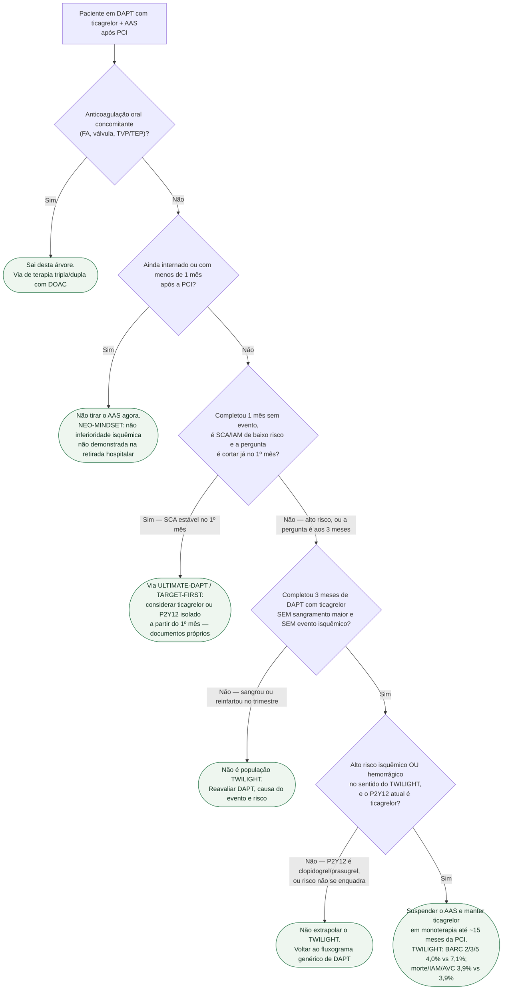

# Fluxograma: retirar o AAS aos 3 meses e manter ticagrelor — a via TWILIGHT

O fluxograma genérico de duração da DAPT da casa organiza SCA versus eletivo e risco hemorrágico. Ele **não nomeia** a estratégia de **tirar o AAS e manter ticagrelor potente**. Esta árvore isola essa via e diz **quando não usá-la**.

## Árvore de decisão

## O que a árvore não mostra

**MASTER-DAPT encurta a DAPT por alto risco hemorrágico e depois deixa um antiplaquetário só — não necessariamente ticagrelor.** É outra pergunta.

**HOST-EXAM e SMART-CHOICE 3 comparam clopidogrel versus AAS na manutenção crônica, depois que a DAPT já acabou.** Entrar nessa comparação só depois dos 6–18 meses (HOST-EXAM) ou da DAPT padrão (SMART-CHOICE 3). Não misturar com o trimestre do TWILIGHT.

**Desescalonar ticagrelor para clopidogrel e manter DAPT** é o ramo C5 do fluxograma genérico, não esta via.

## Mensagem prática

A via TWILIGHT só abre **depois de 3 meses sem evento**, em quem já estava em **ticagrelor**, e consiste em **tirar o AAS — não o P2Y12 potente**.
