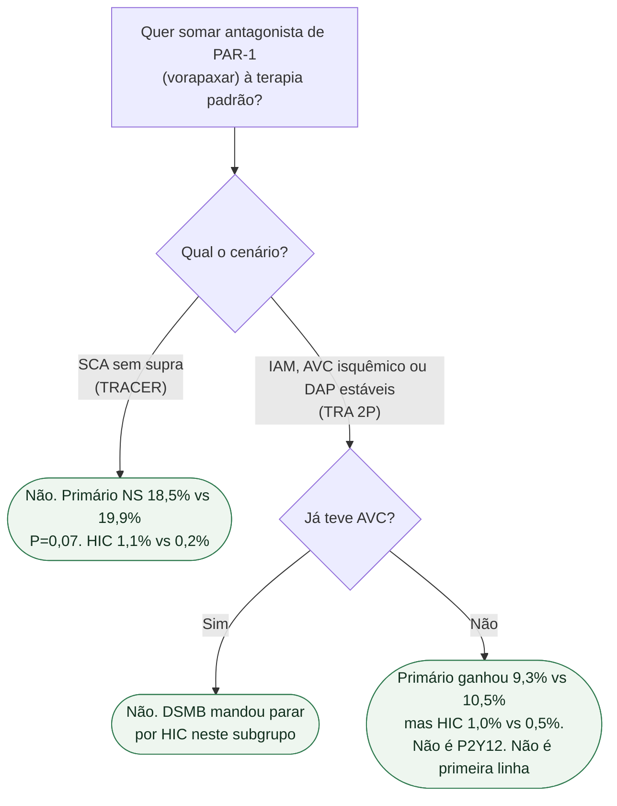

# Fluxograma: vorapaxar

```mermaid
flowchart TD
  R0["Quer somar antagonista de PAR-1<br/>(vorapaxar) à terapia padrão?"] --> D1{"Qual o cenário?"}

  D1 -->|"SCA sem supra<br/>(TRACER)"| C1(["Não. Primário NS 18,5% vs 19,9%<br/>P=0,07. HIC 1,1% vs 0,2%"])

  D1 -->|"IAM, AVC isquêmico ou DAP estáveis<br/>(TRA 2P)"| D2{"Já teve AVC?"}

  D2 -->|"Sim"| C2(["Não. DSMB mandou parar<br/>por HIC neste subgrupo"])

  D2 -->|"Não"| C3(["Primário ganhou 9,3% vs 10,5%<br/>mas HIC 1,0% vs 0,5%.<br/>Não é P2Y12. Não é primeira linha"])

  classDef conduta fill:#eef6ef,stroke:#2f7a4f,color:#12301f;
  class C1,C2,C3 conduta;
```

## Mensagem prática

**TRACER não autoriza vorapaxar na SCA. TRA 2P ganha isquemia na estável e cobra HIC.** Quem já teve AVC saiu do ensaio por segurança.
