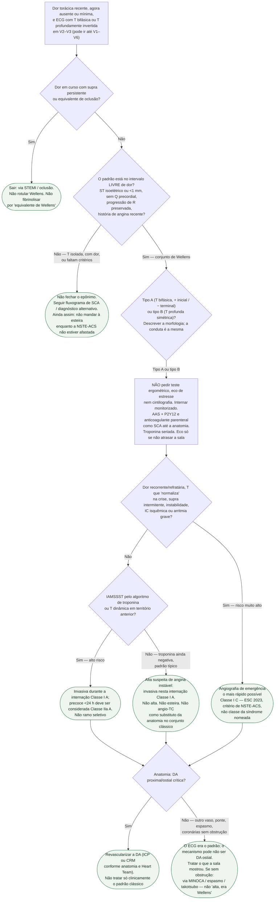

# Fluxograma: Wellens — do ECG à via de anatomia urgente

Esta árvore começa **depois** do ECG de 12 derivações, quando há T bifásica ou T profundamente invertida em precordiais e a pergunta do plantão é “esteira amanhã ou hemodinâmica?”. Não substitui o fluxograma geral de SCA nem o de timing da NSTE-ACS. Desvia para eles quando o caso deixa de ser o padrão de Wellens e vira oclusão em curso, outro diagnóstico ou NSTE-ACS sem o epônimo.

## Árvore de decisão

## Como ler cada desvio

**C1 — supra persistente não é Wellens.** O epônimo descreve T no intervalo *sem* dor. Dor + supra é oclusão até a angiografia. Fibrinolisar “porque é equivalente de Wellens” mistura duas entidades. Equivalentes de supra (SBC 2025, Classe I B para *procurá-los*) são outra lista.

**C2 — critério incompleto não libera esteira.** Faltou história de angina, ou a T é só V1 em mulher jovem, ou o paciente ainda tem dor e o ST não foi serializado. Não fechar o nome. Também não enviar à ergometria “para ver se é isquemia”: se a NSTE-ACS não foi afastada, a esteira continua contraindicada (angina instável = absoluta na SBC 2024).

**D3 — tipo A e tipo B não ramificam conduta.** A bifurcação existe só para obrigar o plantão a *olhar* a morfologia. Tipo A (~25%, bifásica) não é forma menor. A literatura às vezes inverte tipo 1/tipo 2: descreva a onda.

**P1 — a frase que o fluxograma existe para gravar.** Pedido de teste ergométrico e laudo de Wellens não convivem. Internação, DAPT e heparina (ou o anticoagulante do protocolo local) são da via de SCA, não de uma classe inventada para o epônimo. Doses: documento de posologia já publicado.

**C3 versus C4/C5 — o tempo vem da ESC de NSTE-ACS.** Recorrência de dor ou ST/T dinâmico recorrente (sobretudo supra intermitente, ou T que pseudonormaliza) = imediata, Classe I C. IAMSSST ou T dinâmica sem instabilidade = internar para anatomia, visando < 24 h (IIa A) mas de qualquer modo antes da alta (I A). Troponina negativa com conjunto clássico = ainda assim alta suspeita de angina instável → anatomia nesta internação (I A). Nenhum desses três ramos é “Wellens Classe X”.

**C5 — o ramo que a porta mais erra.** Paciente conversando, enzima normal, vaga na esteira amanhã. É exatamente a série de 1982. A ESC reserva o teste não invasivo ao *baixo* índice de suspeita. Este não é o caso.

**C7 — a sala manda no mecanismo.** Wellens clássico é DA proximal. Nem todo padrão de T anterior é ostial, e nem toda DA crítica desenha o padrão. Espasmo, ponte, takotsubo e MINOCA saem para os protocolos próprios. O que não volta é a esteira.

## O que a árvore não mostra

**Percentual de “quantos vão para infarto se não cateterizar”.** A série de 1982 é pré-ICP e pequena. Revisões repetem que a maior parte dos não revascularizados teve infarto anterior em dias. Não usar isso como incidência 2026.

**Especificidade 99% / 97%** citada em algumas revisões. Não conferida em artigo primário nesta revisão editorial. Não entra no diagrama.

**Eco com alteração segmentar.** Apoia, não decide, não atrasa. Por isso ficou em P1 como opcional.

**Qual P2Y12, qual heparina, qual alvo de LDL.** Fora do recorte. Ver posologia e o playbook de alta.

**Classe ESC da síndrome nomeada.** Não existe na tabela. A narrativa cita Wellens’ sign (T bifásica ou T negativa proeminente, DA proximal grave). Fim.

## Tudo com Tudo

- [Protocolo: síndrome de Wellens — reconhecimento e por que não fazer teste ergométrico](sindrome-de-wellens-reconhecimento-e-por-que-nao-fazer-teste-ergometrico.md)
- [Fluxograma: SCA sem supra — timing da estratégia invasiva (ESC 2023)](fluxograma-sca-sem-supra-timing-da-estrategia-invasiva-esc-2023.md)
- [Fluxograma: Síndrome Coronariana Aguda (ESC 2023)](fluxograma-sindrome-coronariana-aguda-esc-2023.md)
- [Protocolo de Dor Torácica na Emergência (SBC 2025)](protocolo-de-dor-toracica-na-emergencia-escore-heart-e-tempo-porta-ecg-sbc-2025.md)
- [Teste Ergométrico — Segurança (SBC 2024)](teste-ergometrico-seguranca-contraindicacoes-e-criterios-de-interrupcao-sbc-2024.md)
- [Posologia de antiagregantes e anticoagulantes na SCA](posologia-de-antiagregantes-e-anticoagulantes-na-sindrome-coronariana-aguda-esc-2023.md)
- [Fluxograma MINOCA](fluxograma-minoca-investigacao-diagnostica.md)
- [Takotsubo](../Saúde_mental_e_cardiologia/fluxograma-cardiomiopatia-takotsubo-reconhecimento-manejo-agudo.md)
- [Cocaína](../Geral/cocaina-e-risco-cardiovascular-vasoespasmo-coronariano-e-infarto.md)
