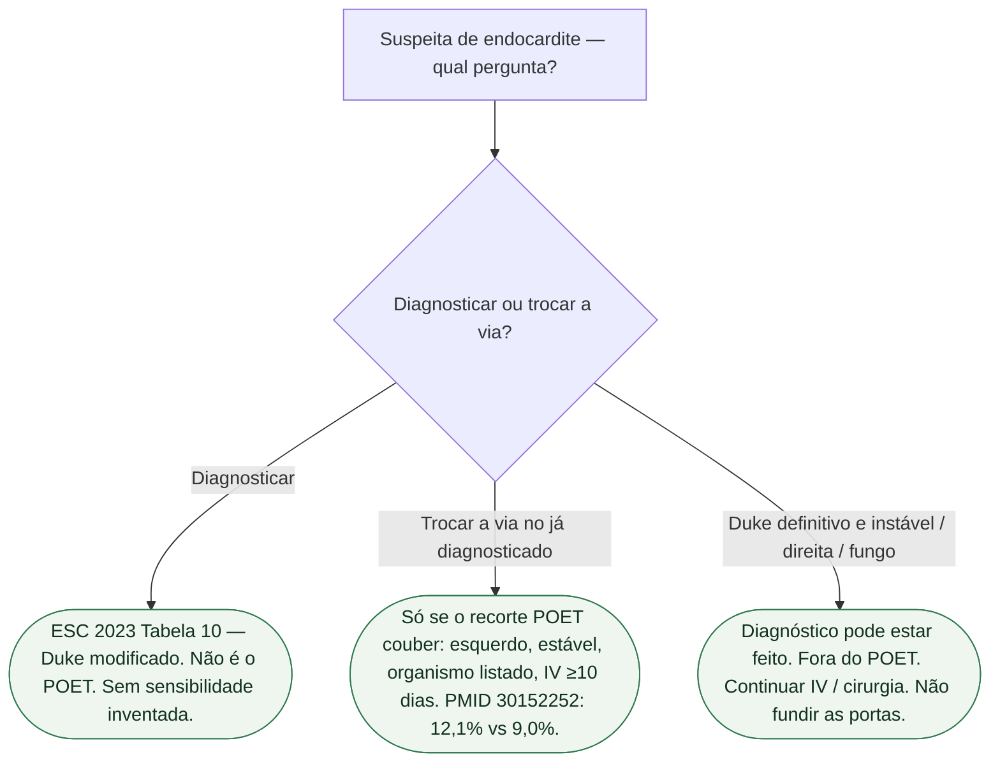

# Duke modificado não é o POET

Diagnosticar endocardite **não** é autorizar troca para oral. Os critérios diagnósticos modificados da ESC 2023 (Delgado, *Eur Heart J*. 2023;44:3948-4042; PMID **37622656**, Tabela 10) respondem: **isto é endocardite?** O POET (Iversen, *N Engl J Med*. 2019;380:415-424; PMID **30152252**; NCT01375257) responde outra pergunta: **neste doente já diagnosticado, lado esquerdo, estável, com o organismo listado, completar o curso por via oral é não inferior ao intravenoso contínuo?** As duas frases não se fundem na alta. Esta ficha **não** substitui `poet-oral-apos-estabilizacao-o-que-o-ensaio-nao-e`, `fluxograma-troca-oral-apos-poet` nem `esc-2023-endocardite-o-que-ainda-e-classe-i-em-2026`.

## O que o Duke/ESC 2023 pergunta

Não saiu diretriz ESC de endocardite em 2024, 2025 ou 2026. O documento vigente continua sendo PMID **37622656**. A Tabela 10 define os critérios diagnósticos modificados: culturas positivas e **imagem positiva para IE** (ETT/ETE, TC cardíaca, [18F]-FDG-PET/CT, WBC SPECT/CT) como critérios **maiores**; *Enterococcus faecalis* entra como microrganismo típico. **Esta ficha não reproduz a tabela.** Não transcreve menores.

**Nenhuma sensibilidade nem especificidade global do Duke é transcrita aqui.** Não inventar “Duke fecha X%”. Não colar o ganho de um organismo num estudo de bacteremia como se fosse a acurácia do critério inteiro.

Classificação diagnóstica definitiva integra o diagnóstico; nenhum critério isolado substitui avaliação clínica. Não responde estabilidade, lado da valva, organismo do POET nem via do antibiótico. Duke **possível** não autoriza oral. Cultura negativa, HACEK, fungo e câmaras direitas podem cumprir diagnóstico e **mesmo assim** ficar fora do recorte do ensaio de troca.

## O que o POET mediu — PubMed 30152252

Abstract aberto nesta sessão. Ensaio dinamarquês, aberto, de não inferioridade. **400** adultos em condição estável com endocardite do **lado esquerdo** causada por estreptococo, *Enterococcus faecalis*, *Staphylococcus aureus* ou estafilococo coagulase-negativo, já em antibiótico intravenoso: continuar IV (**199**) versus trocar para oral (**201**). Intravenoso por pelo menos **10 dias** em todos.

Desfecho primário composto: morte por qualquer causa, cirurgia cardíaca não planejada, evento embólico ou recaída de bacteremia pelo patógeno índice, da randomização até **6 meses** após o fim do antibiótico.

- Intravenoso: **24/199 (12,1%)**
- Oral: **18/201 (9,0%)**
- Diferença **3,1** pontos percentuais; IC95% **−3,4 a 9,6**; P=**0,40**
- Não inferioridade cumprida no abstract.

O artigo integral exigiu endocardite definitiva pelos critérios de Duke modificados, embora isso não conste do resumo. O POET **não** foi estudo de validação diagnóstica. **12,1% versus 9,0%** é composto de **tratamento** depois da estabilidade — não é acurácia de Duke nem sensibilidade de eco.

## Onde a fusão quebra a porta

Não diga: “Duke definitivo, então troca para oral.” Definitivo fecha a infecção. Troca pede o recorte do POET: esquerdo, estável, organismo listado, IV mínimo. Fora desse recorte, definir tratamento por protocolo específico, sem aplicar o POET automaticamente.

Não diga: “o POET prova o diagnóstico.” Ensaio de via **depois** do diagnóstico. Não reescreve a Tabela 10.

Não diga: “imagem maior na ESC 2023 substitui o ETE antes da troca.” Imagem diagnóstica **não** é a pergunta da via. ETE antes de passar de IV para oral mora nas portas de troca, não nesta.

Não é PARTNER 3 (PMID **30883058**). Não é encurtar o curso (pergunta do POET II, porta de duração). Não é oral no primeiro dia. Não é o instável.

## Tudo com Tudo

- [Duração de antibiótico na endocardite: o que os ensaios recentes mostram](/biblioteca/duracao-de-antibiotico-na-endocardite-o-que-ensaios-recentes-mostram)
- [ESC 2023 de endocardite: o que ainda é Classe I em 2026](/biblioteca/esc-2023-endocardite-o-que-ainda-e-classe-i-em-2026)
- [Fluxograma: troca para oral após o POET](/biblioteca/fluxograma-troca-oral-apos-poet)
- [POET: oral após estabilização — o que o ensaio não é](/biblioteca/poet-oral-apos-estabilizacao-o-que-o-ensaio-nao-e)
