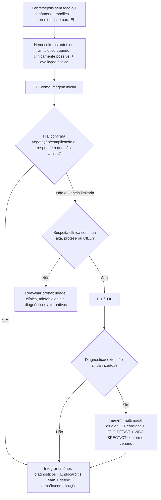
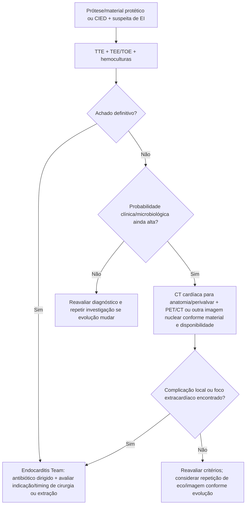

# Endocardite infecciosa — estratégia de imagem multimodal pela ESC 2023

## A mudança prática

TTE e TEE/TOE continuam sendo as técnicas centrais na suspeita de endocardite infecciosa (EI), mas a ESC 2023 incorpora formalmente **CT, imagem nuclear e MRI** quando o ecocardiograma não responde completamente a pergunta — especialmente em próteses, material protético, dispositivos e suspeita de complicação perivalvar ou extracardíaca.

A regra não é “pedir todos os exames”. É usar cada modalidade para resolver a incerteza que permanece após clínica, microbiologia e ecocardiografia.

## Antes da imagem: microbiologia é parte do diagnóstico

Quando a situação clínica permite colher antes de antibiótico, a ESC orienta **pelo menos três conjuntos de hemoculturas**, com intervalo aproximado de 30 minutos, de veia periférica e antes da antibioticoterapia.

Uma única cultura positiva deve ser interpretada com cautela; bacteremia da EI costuma ser contínua, portanto não é necessário esperar pico febril para colher.

## Árvore diagnóstica inicial

## Quando CT cardíaca agrega valor

CT é particularmente útil para caracterizar **complicações perivalvares/periprotéticas** e anatomia quando há dúvida ou limitação ecocardiográfica, incluindo:

- abscesso;
- pseudoaneurisma;
- fístula;
- extensão paravalvar;
- planejamento anatômico pré-operatório em situações selecionadas.

A escolha deve considerar função renal, necessidade de contraste, artefatos e o quanto o resultado mudará manejo.

## Quando PET/CT entra

A imagem metabólica com **18F-FDG PET/CT** pode aumentar a capacidade diagnóstica em cenários com material protético e dispositivos, nos quais o eco isolado pode falhar. Além do foco cardíaco, PET/CT pode ajudar a identificar:

- embolizações sépticas;
- aneurismas infecciosos;
- focos metastáticos de infecção;
- possíveis portas de entrada/focos extracardíacos.

A interpretação precisa considerar o contexto temporal após cirurgia/procedimento e padrões de captação inespecíficos.

## CIED: não olhar apenas o pocket

Em paciente com marca-passo/CDI e bacteremia ou suspeita de EI, deve-se avaliar:

- pocket/gerador;
- eletrodos;
- valvas;
- embolização pulmonar/sistêmica conforme anatomia;
- possibilidade de infecção concomitante sem sinais locais exuberantes.

## Árvore: prótese valvar ou CIED com suspeita persistente

## Endocarditis Team cedo, não apenas quando a cirurgia já está decidida

A ESC 2023 recomenda envolvimento precoce da **Endocarditis Team**. Isso é especialmente relevante quando existem:

- insuficiência cardíaca;
- infecção não controlada;
- complicação perivalvar;
- eventos embólicos;
- prótese/dispositivo;
- necessidade potencial de cirurgia;
- incerteza entre continuar investigação e intervir.

## Biomarcadores não diagnosticam EI

PCR, procalcitonina, leucograma, troponina, peptídeos natriuréticos, creatinina e outros marcadores podem ajudar a avaliar gravidade e resposta, mas **nenhum biomarcador tem especificidade suficiente para diagnosticar endocardite**.

## Armadilhas

1. Não excluir EI porque TTE inicial foi negativo quando a probabilidade clínica é alta.
2. Não atrasar hemoculturas esperando febre subir.
3. Não interpretar uma única hemocultura positiva fora do contexto clínico como diagnóstico automático.
4. Não usar PET/CT como substituto de microbiologia e ecocardiografia; é ferramenta complementar.
5. Não esquecer embolização/focos extracardíacos quando sintomas sistêmicos persistem.

## Fonte verificada

Delgado V, Ajmone Marsan N, de Waha S, et al. 2023 ESC Guidelines for the management of endocarditis. *Eur Heart J.* 2023;44(39):3948-4042. PMID **37622656**. DOI **10.1093/eurheartj/ehad193**.

## Status de revisão

`VERIFICAÇÃO HUMANA NECESSÁRIA`: antes de transformar esta árvore em protocolo institucional automatizado, conferir diretamente as Recommendation Tables da ESC 2023 para classe/nível e critérios formais de PET/CT, WBC SPECT/CT e CT em cada subtipo de prótese/dispositivo.
