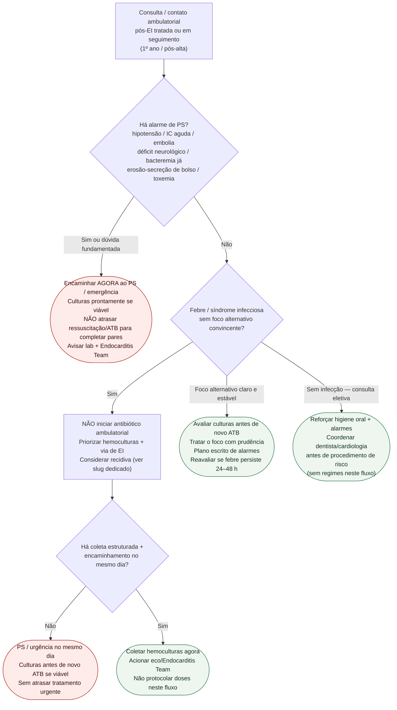

# Fluxograma ambulatorial: pós-tratamento de endocardite — destino

Prosa: [`sinalizadores-ambulatoriais-pos-tratamento-endocardite-quando-escalar`](/biblioteca/sinalizadores-ambulatoriais-pos-tratamento-endocardite-quando-escalar). Checklist: [`checklist-ambulatorial-pos-ei-higiene-oral-e-alarmes`](/biblioteca/checklist-ambulatorial-pos-ei-higiene-oral-e-alarmes). Suspeita pré-diagnóstico (não confundir): [`esc-2023-diretriz-endocardite-infecciosa`](/biblioteca/esc-2023-diretriz-endocardite-infecciosa). Recidiva (definições): [`recidiva-da-endocardite-infecciosa-relapso-versus-reinfeccao`](/biblioteca/recidiva-da-endocardite-infecciosa-relapso-versus-reinfeccao).

## Árvore de decisão

## Notas

- **D1** = segurança (instabilidade / embolia / IC / bolso / toxemia).
- **D2/D3** = freio ao antibiótico empírico; hemoculturas **antes** de ATB.
- **C5** = braço educativo (ESC 2023 follow-up); regimes ficam no slug de profilaxia.
- Não decide Duke, esquema, OPAT, timing cirúrgico nem relapso vs reinfecção pelo agente.

## Culturas e tratamento em curso

Febre isolada em paciente estável após EI exige avaliação estruturada no mesmo dia, com hemoculturas e contato com a equipe; usar urgência/PS se essa estrutura não existir. Instabilidade, sepse, IC aguda ou embolia exigem emergência imediata. Foco urinário, respiratório ou dentário plausível não exclui bacteremia/recidiva: colher culturas antes de novo antibiótico quando possível, sem atrasar ressuscitação ou tratamento urgente.

Não interromper OPAT nem tratamento oral parcial prescrito para melhorar rendimento de culturas por iniciativa do paciente. Informar nomes, horários e última dose à equipe. Na suspeita de falha, a equipe decide coleta e ajuste imediato do esquema. A recomendação de culturas pré-antibiótico refere-se à coleta rápida antes de nova terapia quando viável, e não à suspensão indiscriminada da terapia em curso.
