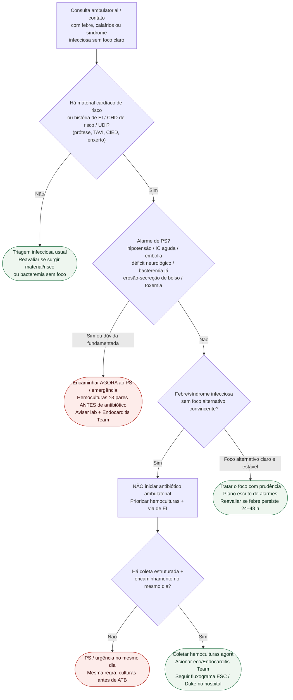

# Fluxograma ambulatorial: suspeita de endocardite — destino

Prosa: [`sinalizadores-ambulatoriais-suspeita-endocardite-quando-encaminhar`](sinalizadores-ambulatoriais-suspeita-endocardite-quando-encaminhar.md). Checklist: [`endocardite-checklist-ambulatorial-febre-protese-dispositivo`](endocardite-checklist-ambulatorial-febre-protese-dispositivo.md). Duke: [`fluxograma-endocardite-duke-iscvid-2023-aplicacao-dos-criterios`](fluxograma-endocardite-duke-iscvid-2023-aplicacao-dos-criterios.md). Visão geral: [`fluxograma-endocardite-infecciosa-esc-2023`](fluxograma-endocardite-infecciosa-esc-2023.md).

## Árvore de decisão

## Notas

- **D1** = gate de risco (ESC 2023: suspeita dirigida por fatores de risco + febre/sepsis sem foco).
- **D2** = segurança (instabilidade / embolia / IC / bolso infectado).
- **D3/D4** = freio ao antibiótico empírico ambulatorial; hemoculturas **antes** de ATB.
- Não decide Duke, esquema antibiótico, OPAT nem timing cirúrgico.
