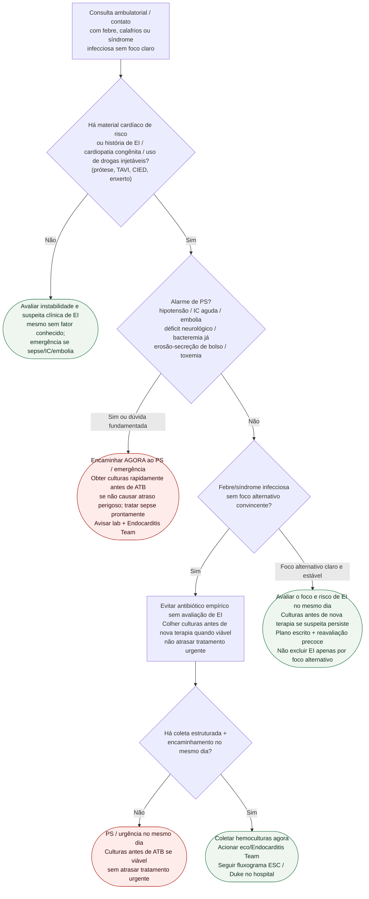

# Fluxograma ambulatorial: suspeita de endocardite — destino

Prosa: [sinalizadores-ambulatoriais-suspeita-endocardite-quando-encaminhar](/biblioteca/sinalizadores-ambulatoriais-suspeita-endocardite-quando-encaminhar). Checklist: [endocardite-checklist-ambulatorial-febre-protese-dispositivo](/biblioteca/endocardite-checklist-ambulatorial-febre-protese-dispositivo). Duke: [fluxograma-endocardite-duke-iscvid-2023-aplicacao-dos-criterios](/biblioteca/fluxograma-endocardite-duke-iscvid-2023-aplicacao-dos-criterios). Visão geral: [fluxograma-endocardite-infecciosa-esc-2023](/biblioteca/fluxograma-endocardite-infecciosa-esc-2023).

## Árvore de decisão

## Notas

- **D1** = gate de risco (ESC 2023: suspeita dirigida por fatores de risco + febre/sepsis sem foco).
- **D2** = segurança (instabilidade / embolia / IC / bolso infectado).
- **D3/D4** = freio ao antibiótico empírico ambulatorial; hemoculturas **antes** de ATB.
- Não decide Duke, esquema antibiótico, OPAT nem timing cirúrgico.

## Segurança da coleta e do encaminhamento

Não suspender automaticamente antibiótico já iniciado. Registrar molécula, dose, horário e motivo; colher antes de novas doses quando clinicamente seguro, deixando decisão de manter/ajustar/suspender à equipe. Em sepse/instabilidade, obter culturas prontamente sem atrasar tratamento por logística ou pelo número ideal de amostras. Em paciente estável, usar 3 conjuntos (sets), cada um com frascos aeróbio e anaeróbio conforme protocolo local.

Febre com prótese/TAVI/CIED ou EI prévia aumenta suspeita, sem confirmar diagnóstico: paciente estável pode seguir via estruturada no mesmo dia com culturas, exame, acesso rápido a eco e Endocarditis Team; sem essa estrutura, PS. Secreção purulenta e hardware exposto são alarmes independentes de febre; eritema/dor isolados têm diferenciais. Foco alternativo não encerra EI se febre persistente/recorrente, bacteremia típica, embolia ou ausência de resposta.
