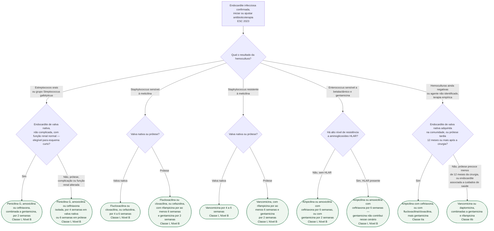

# Fluxograma: Escolha e duração da antibioticoterapia na endocardite infecciosa por agente etiológico (ESC 2023)

O documento de esquemas antibióticos já publicado nesta pasta traz, em prosa e tabelas, o
regime de cada agente identificado por hemocultura e o esquema empírico antes da
identificação. Este fluxograma organiza a mesma informação como árvore de decisão, partindo
do agente etiológico (ou da ausência dele) até o fármaco e a duração, sempre distinguindo
valva nativa de prótese — a distinção que mais muda o tratamento em cada ramo.

## Árvore de decisão

## O que a árvore não mostra

- **Agentes de cultura negativa e patógenos incomuns não estão incluídos.** *Legionella*,
  *Bartonella*, *Coxiella*, *Brucella* e fungos têm tabela própria na diretriz, com esquemas
  longos e específicos (por exemplo, *Legionella* recebe levofloxacino 500 mg a cada 12
  horas por 6 semanas ou mais) — fora do escopo desta árvore, que cobre os agentes mais
  frequentes.
- **A estrutura em duas fases do tratamento não aparece como ramo.** Em geral, as duas
  primeiras semanas são de terapia parenteral hospitalar — é a janela em que a cirurgia
  indicada, a remoção de material infectado e a drenagem de abscesso devem acontecer — e a
  fase seguinte pode ser oral ou parenteral ambulatorial em paciente selecionado e estável,
  até completar a duração total indicada em cada ramo.
- **Ajuste renal e monitorização de nível sérico não estão contemplados.** Vancomicina,
  gentamicina e os demais fármacos desta árvore exigem ajuste por função renal e
  monitorização de concentração sérica que este fluxograma não cobre.
- **As doses exatas de cada fármaco** (por exemplo, penicilina G 12–18 milhões U/dia,
  vancomicina 30–60 mg/kg/dia, gentamicina 3 mg/kg/dia) estão detalhadas no documento de
  esquemas antibióticos já publicado nesta pasta, e não foram repetidas nos nós da árvore
  para manter os rótulos legíveis.
- **Se as hemoculturas iniciais forem negativas e não houver resposta clínica**, a diretriz
  orienta considerar etiologia de cultura negativa e ampliar o espectro — e, havendo
  indicação cirúrgica, buscar diagnóstico molecular no material operatório.
- **A decisão de operar corre em paralelo ao antibiótico, não depois dele** — a indicação e
  o timing cirúrgico têm documentos próprios nesta pasta, inclusive o de timing após
  complicação neurológica.
