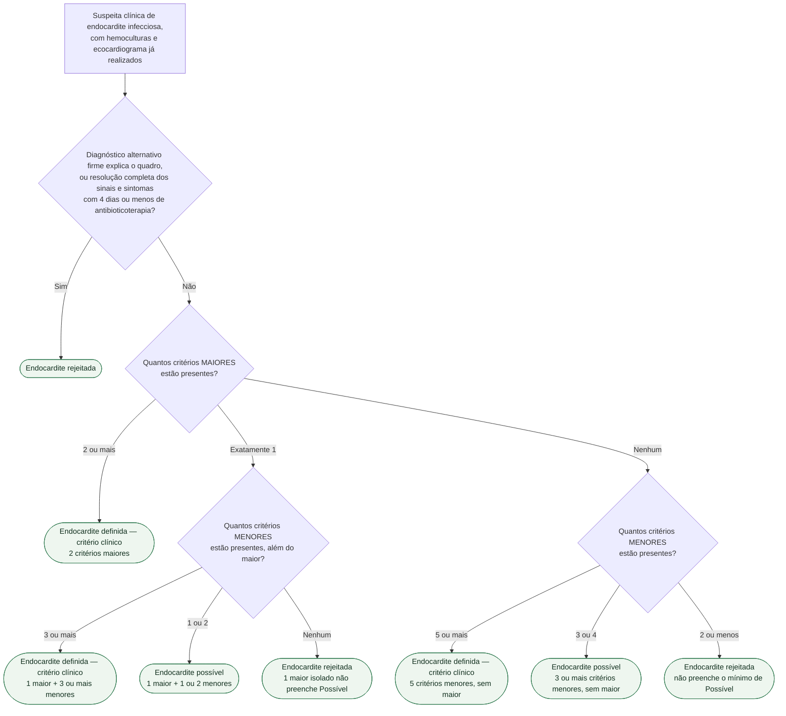
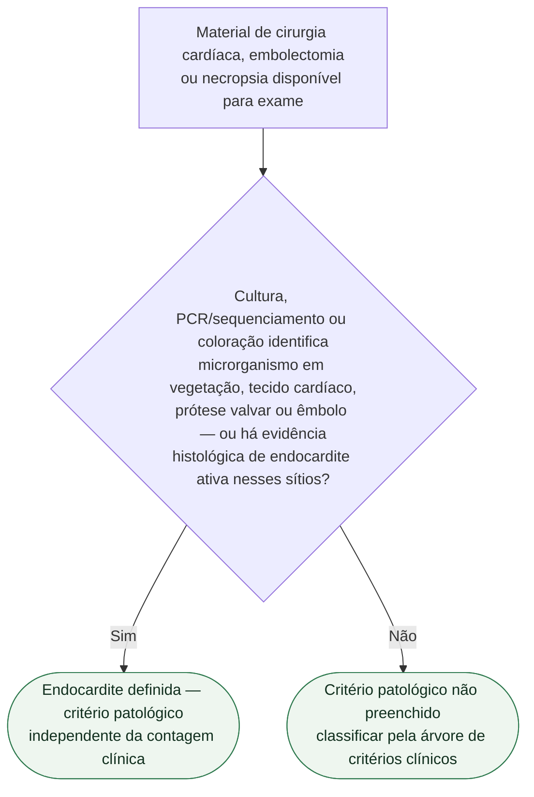

# Fluxograma: aplicação dos critérios de Duke-ISCVID 2023

Os critérios de Duke modificados classificavam a endocardite infecciosa (EI)
em Definida, Possível ou Rejeitada a partir de uma contagem de critérios
maiores e menores. A atualização Duke-ISCVID de 2023 manteve essa mesma
lógica de contagem — o que mudou foi a lista de itens que entram em cada
categoria (mais microrganismos considerados típicos, TC cardíaca e PET/TC
com 18F-FDG como critério maior de imagem, inspeção cirúrgica direta como
novo critério maior, e dispositivo cardíaco implantável como predisposição
menor).

Este fluxograma é o passo a passo da **contagem** em si — a peça que falta
no fluxograma geral já publicado nesta pasta
(*Endocardite infecciosa — da suspeita à indicação cirúrgica, ESC 2023*),
que trata "classificar pelos critérios da ESC 2023" como uma etapa única,
sem detalhar como a contagem chega ao resultado.

## Critérios maiores

**A) Microbiológicos** — hemoculturas positivas para microrganismo típico de
EI (*Staphylococcus aureus*, *S. lugdunensis*, *Enterococcus faecalis*,
estreptococos exceto *S. pneumoniae* e *S. pyogenes*, grupo HACEK,
*Granulicatella*, *Abiotrophia*, *Gemella* spp.) em 2 ou mais hemoculturas
separadas, ou microrganismo não típico em 3 ou mais hemoculturas separadas
— e, na presença de material protético, também são típicos estafilococos
coagulase-negativos, *Corynebacterium* spp., *Serratia marcescens*,
*Pseudomonas aeruginosa*, *Cutibacterium acnes*, micobactérias não
tuberculosas e *Candida* spp. Também entram aqui PCR ou outro teste de
ácido nucleico positivo para *Coxiella burnetii*, *Bartonella* spp. ou
*Tropheryma whipplei*, sorologia de fase I para *C. burnetii* IgG > 1:800
(ou isolamento em hemocultura única), e imunofluorescência indireta para
*Bartonella henselae*/*Bartonella quintana* com IgG ≥ 1:800.

**B) De imagem** — vegetação, perfuração ou aneurisma de folheto valvar,
abscesso, pseudoaneurisma ou fístula intracardíaca ao ecocardiograma ou à
TC cardíaca; nova regurgitação valvar significativa em comparação a exame
prévio; nova deiscência parcial de prótese valvar; e, ao PET/TC com
18F-FDG, atividade metabólica anormal envolvendo valva nativa ou protética,
enxerto aórtico ascendente com envolvimento valvar, eletrodo de dispositivo
intracardíaco ou material protético — captação intensa, focal/multifocal
ou heterogênea após 3 meses do implante em prótese, qualquer padrão anormal
em valva nativa.

**C) Cirúrgico (novo em 2023)** — evidência de EI documentada por inspeção
direta durante cirurgia cardíaca, usado quando os critérios maiores de
imagem e a confirmação histológica/microbiológica não estão disponíveis.

## Critérios menores

- **Predisposição**: EI prévia, prótese valvar ou reparo valvar prévio,
  cardiopatia congênita, regurgitação ou estenose valvar mais que leve,
  dispositivo cardíaco eletrônico implantável (via endovascular),
  cardiomiopatia hipertrófica obstrutiva, uso de droga injetável.
- **Febre**: temperatura documentada acima de 38,0 °C.
- **Fenômenos vasculares**: êmbolo arterial, infarto pulmonar séptico,
  abscesso cerebral ou esplênico, aneurisma micótico, hemorragia
  intracraniana, hemorragia conjuntival, lesões de Janeway, púrpura
  purulenta.
- **Fenômenos imunológicos**: fator reumatoide positivo, nódulos de Osler,
  manchas de Roth, glomerulonefrite por imunocomplexos.
- **Evidência microbiológica que não atinge critério maior**: hemocultura
  positiva sem preencher o critério maior, ou cultura/PCR/teste de ácido
  nucleico positivo em sítio estéril que não seja tecido cardíaco, prótese
  ou êmbolo.
- **Imagem (menor)**: atividade metabólica anormal ao PET/TC com 18F-FDG
  dentro dos primeiros 3 meses após o implante de material protético.
- **Exame físico**: regurgitação valvar nova identificada à ausculta,
  quando a ecocardiografia não está disponível.

## Árvore de decisão: critérios clínicos

## Árvore de decisão: critério patológico

A classificação por critério patológico é uma via **independente** da
contagem clínica acima — quando disponível material de cirurgia,
embolectomia ou necropsia, ela sozinha já define o diagnóstico,
qualquer que seja o resultado da contagem clínica.

## Notas de aplicação

- A classificação **não é definitiva desde a primeira avaliação**: um caso
  Possível ou mesmo Rejeitado deve ser reclassificado sempre que um novo
  achado (hemocultura adicional, novo exame de imagem, material cirúrgico)
  mudar a contagem — é a mesma lógica de reavaliação já registrada no
  fluxograma geral desta pasta, que recomenda repetir o ecocardiograma
  transesofágico em 5 a 7 dias quando a suspeita clínica permanece alta.
- Este fluxograma aplica especificamente os critérios **Duke-ISCVID 2023**
  (Fowler et al., *Clin Infect Dis* 2023). A diretriz ESC 2023 de
  endocardite incorpora uma versão própria, muito semelhante, com pequena
  diferença de desempenho na mesma coorte de validação: sensibilidade de
  82,7% e especificidade de 92,3% para os critérios da ESC 2023, contra
  84,2% e 93,9% para a Duke-ISCVID — números já registrados no documento
  publicado *Endocardite infecciosa — da suspeita à indicação cirúrgica
  (ESC 2023)* desta pasta. As duas versões concordam na estrutura de
  contagem (2 maiores, ou 1 maior + 3 menores, ou 5 menores, para
  Definida); a diferença está em detalhes finos da lista de itens
  aceitos em cada critério.
- Presença de dispositivo cardíaco implantável entra como critério
  **menor de predisposição** — não deve ser contada isoladamente como
  achado de imagem, que é um critério à parte.
