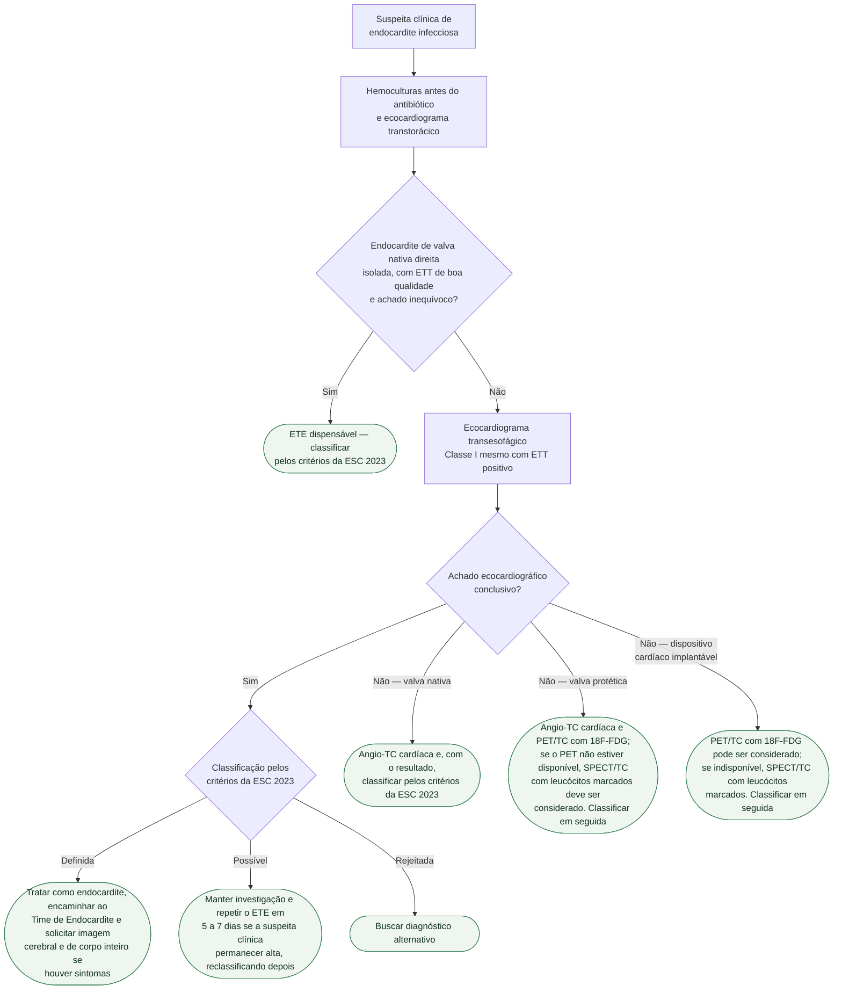
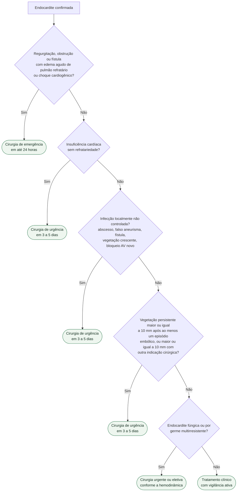

# Fluxograma: Endocardite infecciosa (ESC 2023)

A diretriz ESC 2023 reorganizou o diagnóstico em torno de três pilares que
caminham juntos desde a primeira hora — **quadro clínico, hemoculturas e
imagem** — e ampliou a imagem para além da ecocardiografia. A mudança prática
mais importante é que o ecocardiograma transesofágico deixou de ser exame de
resgate: passou a ser recomendação Classe I mesmo quando o transtorácico já é
positivo, com uma única exceção.

## Caminho diagnóstico

## Onde tratar

A diretriz separa o destino do paciente pela complexidade do quadro:

- **endocardite não complicada** — pode ser conduzida no centro de origem,
  com comunicação regular com um Heart Valve Center;
- **endocardite complicada** — deve ser tratada em Heart Valve Center que
  disponha de Time de Endocardite e de estrutura para cirurgia imediata.

O Time de Endocardite reúne cardiologista, especialista em imagem, cirurgião
cardiovascular, infectologista, microbiologista e o responsável pelo regime
antibiótico parenteral ambulatorial.

## Indicação e prazo da cirurgia

São três as famílias de indicação — insuficiência cardíaca, infecção não
controlada e prevenção de embolia. O que muda entre elas é o prazo.

## Situações que têm regra própria

- **Endocardite precoce de prótese** (nos primeiros 6 meses): desbridamento
  completo e troca valvar.
- **Endocardite relacionada a dispositivo cardíaco implantável**: extração
  completa do sistema, sem adiamento, já durante a antibioticoterapia
  empírica inicial.
- **Endocardite de câmaras direitas**: cirurgia na regurgitação tricúspide
  aguda grave com disfunção de ventrículo direito, embolia pulmonar
  recorrente ou vegetação residual maior que 20 mm. Nesse cenário, o reparo
  da valva tricúspide deve ser considerado em vez da troca.
- **Complicação neurológica**: após ataque isquêmico transitório ou acidente
  vascular cerebral não hemorrágico, a cirurgia não deve ser adiada quando há
  insuficiência cardíaca, infecção não controlada ou abscesso. Depois de
  acidente vascular hemorrágico, o adiamento por pelo menos 4 semanas é a
  conduta usual.

## Antibioticoterapia: o desenho em duas fases

A ESC 2023 consolidou o tratamento em duas fases — cerca de 2 semanas
iniciais de terapia parenteral hospitalar, seguidas de até 6 semanas de
tratamento oral ou parenteral ambulatorial em pacientes selecionados. A
duração total é de 2 a 6 semanas na valva nativa e de pelo menos 6 semanas na
prótese valvar.

A troca para via oral só é feita depois que o ecocardiograma transesofágico
documenta ausência de progressão local e de complicações — é por isso que o
ETE também é recomendação Classe I antes da transição de via.

Outros pontos do regime: aminoglicosídeo não é recomendado na endocardite
estafilocócica de valva nativa; rifampicina entra apenas quando há material
protético envolvido; e a daptomicina, quando usada, é em dose alta —
10 mg/kg uma vez ao dia.

## Critérios diagnósticos: o que mudou

Os critérios de Duke foram atualizados em 2023 em duas versões próximas — a
Duke-ISCVID, publicada em *Clinical Infectious Diseases*, e a versão da
própria ESC, incorporada a esta diretriz. As duas ampliaram a lista de
microrganismos considerados típicos, incorporaram TC cardíaca e PET/TC com
18F-FDG aos critérios de imagem e acrescentaram a presença de dispositivo
cardíaco implantável como critério menor de predisposição. A Duke-ISCVID
também elevou a inspeção intraoperatória a critério clínico maior.

O ganho é de sensibilidade: a versão de 2023 alcançou 84% de sensibilidade
clínica contra 70% da versão anterior. Os critérios da ESC 2023 tiveram
sensibilidade de 82,7% e especificidade de 92,3%, contra 84,2% e 93,9% da
Duke-ISCVID na mesma coorte.

## Profilaxia antibiótica

A profilaxia é recomendada para pacientes de alto risco submetidos a
procedimentos odontológicos. Deve ser considerada em quem tem reparo
transcateter prévio de valva mitral ou tricúspide, e pode ser considerada em
transplantados cardíacos e em pacientes de alto risco submetidos a
procedimentos invasivos. Não há indicação de profilaxia antes de
procedimento odontológico com o objetivo de prevenir endocardite associada a
dispositivo cardíaco implantável.
