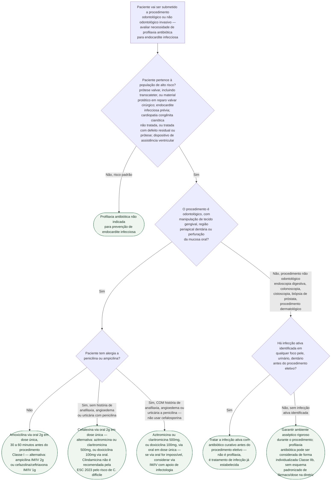

# Fluxograma: Profilaxia antibiótica de endocardite infecciosa antes de procedimento odontológico ou não odontológico (ESC 2023)

Esta pasta já tem um documento dedicado à profilaxia em procedimento odontológico e outro à
profilaxia em procedimento não odontológico — e a diretriz chega a conclusões
estruturalmente diferentes nos dois casos, o erro mais comum sendo tratá-los como
equivalentes. Este fluxograma reúne as duas decisões numa única árvore, partindo sempre da
mesma primeira pergunta: o paciente pertence à população de alto risco de desfecho adverso
por endocardite.

## Árvore de decisão

## O que a árvore não mostra

- **A justificativa para a Classe IIb em procedimento não odontológico não é nova evidência
  de eficácia.** A própria diretriz é explícita: "nenhuma evidência convincente foi
  apresentada sobre a relação entre bacteremia resultante de um procedimento não
  odontológico e o risco de endocardite infecciosa subsequente". A elevação de Classe III
  (diretriz anterior) para Classe IIb (ESC 2023) refletiu maior sobrevida dos pacientes e
  maior complexidade cirúrgica ao longo do tempo, não uma demonstração direta de que a
  profilaxia previne esses casos.
- **Não existe esquema de fármaco/dose padronizado para o ramo Classe IIb** (procedimento
  não odontológico). Onde a decisão individualizada optar por profilaxia nesse cenário, a
  escolha deve ser discutida caso a caso, idealmente com infectologia — o documento de
  origem já registra essa lacuna como `VERIFICAÇÃO HUMANA NECESSÁRIA`, e esta árvore não
  inventa um esquema para preenchê-la.
- **Reparo transcateter de valva mitral ou tricúspide** (Classe IIa, "deve ser considerada")
  e **transplante cardíaco em geral, sem exigir valvopatia associada** (Classe IIb, "pode ser
  considerada") são populações com recomendação mais fraca que a população de alto risco
  Classe I usada no nó raiz — tratadas em detalhe no documento de profilaxia odontológica já
  publicado nesta pasta, não repetidas aqui para manter a árvore legível.
- **Planejamento pré-procedimento de médio prazo não é profilaxia do dia do procedimento.**
  A diretriz recomenda eliminar focos de sepse dentária pelo menos 2 semanas antes de
  implante de prótese valvar ou outro material intracardíaco/intravascular — medida de
  prevenção geral, distinta da dose única administrada antes do procedimento odontológico em
  si.
- **Revisão sistemática Cochrane (2022) não encontrou evidência conclusiva de ensaio clínico
  randomizado** comprovando eficácia da profilaxia antes de procedimento dentário — a
  decisão de profilaxiar continua apoiada em consenso de especialistas e plausibilidade
  biológica, não em ensaio controlado robusto. Isso não muda a recomendação vigente, mas
  contextualiza a força real da evidência por trás dela.
- **Cardiopatia congênita corrigida cirurgicamente só mantém indicação de profilaxia nos
  primeiros 6 meses após o reparo completo**, na ausência de defeito residual ou prótese —
  detalhe que não coube no rótulo do nó raiz e está descrito por extenso no documento de
  profilaxia odontológica já publicado nesta pasta.
