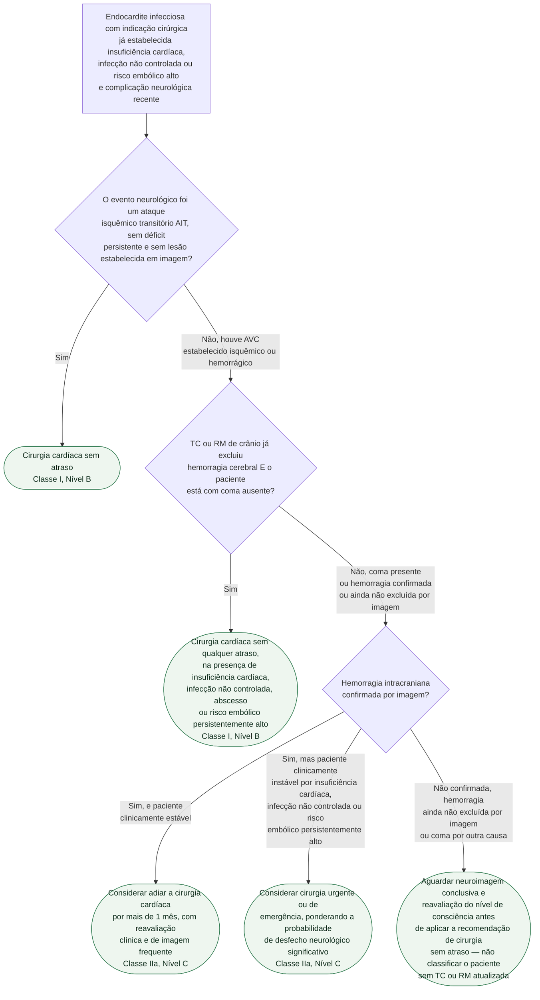

# Fluxograma: Timing cirúrgico na endocardite infecciosa após complicação neurológica (ESC 2023)

O documento geral de indicações e timing cirúrgico já publicado nesta pasta cobre as três
famílias de indicação — insuficiência cardíaca, infecção não controlada e risco embólico —
e seus prazos gerais. Este fluxograma isola a decisão mais frequentemente mal aplicada na
prática: o que fazer quando a indicação cirúrgica já existe e o paciente teve uma
complicação neurológica. A condição central da diretriz não é "o AVC foi isquêmico ou
hemorrágico", e sim se o coma está ausente e a hemorragia cerebral já foi excluída por
imagem.

## Árvore de decisão

## O que a árvore não mostra

- **Trombólise é formalmente contraindicada** no AVC embólico por endocardite infecciosa —
  Classe III, Nível C — ao contrário do AVC isquêmico de outras etiologias, em que a
  trombólise é conduta padrão. Essa contraindicação é decisão paralela ao timing cirúrgico,
  não um ramo da árvore acima.
- **Aneurisma micótico (infeccioso) muda o plano de investigação.** TC ou angio-RM de crânio
  é recomendada (Classe I, Nível B) quando há suspeita de aneurisma cerebral infeccioso;
  neurocirurgia ou terapia endovascular é recomendada (Classe I, Nível C) para aneurismas
  grandes, em crescimento apesar de antibioticoterapia ótima, ou rotos. A árvore trata só do
  timing da cirurgia cardíaca — a via de tratamento do próprio aneurisma é decisão paralela.
- **Números de contexto que pesam na decisão clínica, mas não mudam a classificação
  formal**: o risco de transformação hemorrágica pós-operatória após AVC pré-operatório é de
  2 a 7%, ocorrendo com frequência semelhante em quem teve embolismo cerebral silencioso
  (achado só por imagem); quando ocorre, associa-se a mortalidade de 40%. A mortalidade
  cirúrgica hospitalar da endocardite em geral é de 10 a 20%, particularmente acima de
  75 anos, por comorbidade e complicação da própria endocardite — não especificamente por
  AVC prévio.
- **A regra de "mais de 1 mês" no AVC hemorrágico não é absoluta.** Estudos retrospectivos
  relatam benefício de cirurgia precoce (dentro de 2 semanas) em casos selecionados, sem
  piorar desfecho — mas a diretriz não eleva isso a recomendação formal, mantendo o adiamento
  padrão como Classe IIa.
- **Este fluxograma não substitui o documento geral de indicação e timing cirúrgico** já
  publicado nesta pasta — é o complemento específico da Seção 10.4 (complicação
  neurológica), pressupondo que uma das três indicações cirúrgicas gerais já foi confirmada.
