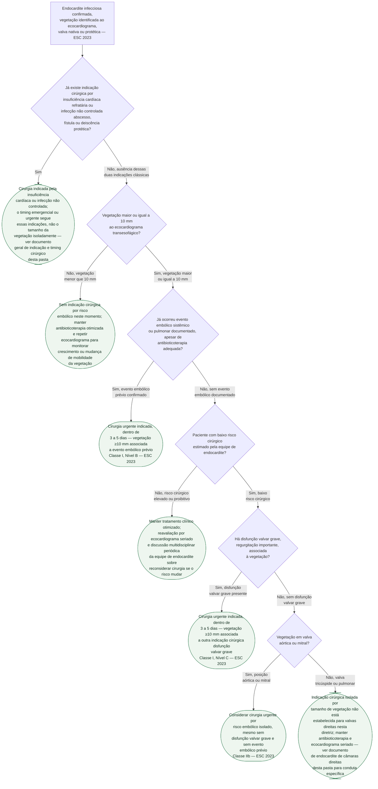

# Fluxograma: Timing cirúrgico na endocardite infecciosa por vegetação grande e risco embólico (ESC 2023)

Esta pasta já tem um fluxograma para o timing cirúrgico **depois** de uma complicação
neurológica já ocorrida (AVC isquêmico ou hemorrágico) e um documento em prosa com a visão
geral das três indicações cirúrgicas — insuficiência cardíaca, infecção não controlada e
risco embólico. Este fluxograma isola a pergunta que fica no meio desses dois: **antes** de
qualquer evento neurológico, o tamanho da vegetação e a ocorrência (ou não) de um episódio
embólico prévio já mudam a indicação e a urgência da cirurgia cardíaca. É a decisão que a
diretriz ESC 2023 reformulou de forma mais explícita em relação à versão anterior,
introduzindo o corte de 10 mm como novidade Classe I quando associado a outra indicação, e
um novo Classe IIb para vegetação isolada em posição aórtica ou mitral.

## Árvore de decisão

## O que a árvore não mostra

- **Mobilidade da vegetação é preditor independente, e a árvore só usa tamanho.** No estudo
  de Thuny et al. (n=384, 34,1% de embolia total, 7,3% de embolia nova sob antibioticoterapia),
  o comprimento da vegetação **acima de 10 mm** e a **mobilidade acentuada** foram preditores
  independentes de embolia nova, mesmo após ajuste para *Staphylococcus aureus* e
  *Streptococcus bovis* (dois microrganismos que, isoladamente, já se associaram a embolia em
  qualquer momento da doença). Vegetação **acima de 15 mm** foi preditor independente de
  mortalidade em 1 ano (risco relativo ajustado 1,8; IC95% 1,10–2,82; p=0,02). A árvore não
  ramifica por mobilidade nem incorpora esse segundo corte de 15 mm — são informações
  contextuais que pesam na decisão da equipe de endocardite, não critérios formais e
  independentes na diretriz.
- **O ensaio EASE apoia diretamente o ramo de disfunção valvar grave, não o ramo isolado por
  tamanho.** O EASE (Kang et al., N Engl J Med 2012) randomizou 76 pacientes com endocardite
  de **valva nativa esquerda, doença valvar grave E vegetação grande** — as duas condições
  juntas, não vegetação isolada — para cirurgia precoce (dentro de 48 horas) ou tratamento
  convencional. O desfecho composto de óbito hospitalar e evento embólico em 6 semanas ocorreu
  em 1 paciente (3%) no grupo de cirurgia precoce contra 9 (23%) no convencional (razão de risco
  0,10; IC95% 0,01–0,82; p=0,03), sem diferença de mortalidade por qualquer causa em 6 meses.
  Este resultado sustenta com mais força o ramo **C5** (vegetação associada a disfunção valvar
  grave) do que o ramo **C6** (vegetação isolada, sem disfunção grave) — a evidência randomizada
  para cirurgia por tamanho **isolado**, sem outro critério associado, é mais fraca, e é por
  isso que a diretriz classifica esse cenário como IIb, não como I.
- **O corte de 30 mm da literatura é sobre risco de complicação neurológica, não é um critério
  formal de indicação cirúrgica isolada.** A metanálise já citada no documento geral desta
  pasta (PMID 29459947) associa vegetação acima de 10 mm, e sobretudo acima de 30 mm, a maior
  risco de complicação neurológica — mas esse número não aparece como corte na recomendação
  Classe IIb da ESC 2023, que usa apenas o limiar de 10 mm. Por isso a árvore não usa 30 mm como
  ramo de decisão, para não atribuir à diretriz um corte que pertence a outra fonte.
- **A decisão de operar corre em paralelo ao esquema antibiótico**, não depois dele — os
  esquemas por agente e o esquema empírico têm fluxograma próprio nesta pasta.
- **Se sobrevier AVC ou outra complicação neurológica no meio deste algoritmo**, a decisão de
  timing muda de árvore — ver o fluxograma de timing cirúrgico após complicação neurológica
  desta mesma pasta, que trata especificamente da presença de coma e da exclusão de hemorragia
  por imagem.
- **Endocardite de câmaras direitas tem racional próprio**, incluindo aspiração mecânica
  percutânea como alternativa à cirurgia aberta em casos selecionados — ver o documento
  dedicado a endocardite de câmaras direitas desta pasta.
- **"Baixo risco cirúrgico" não é definido numericamente nesta árvore.** A diretriz remete à
  avaliação da equipe de endocardite (heart team), que pondera idade, comorbidade, escore de
  risco cirúrgico e fragilidade — não há um corte único de escore citado nas fontes usadas aqui.
