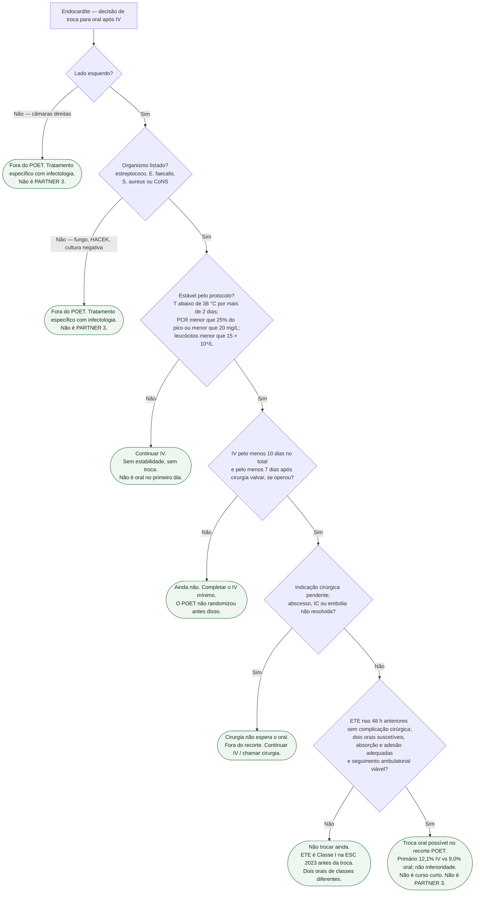

# Fluxograma: troca para oral após o POET

Pergunta desta árvore: **neste paciente com endocardite, o recorte do POET (PMID 30152252) autoriza completar o curso por via oral?** Não inventar tempo de internamento. Não é o PARTNER 3 (PMID 30883058). Não é ensaio de encurtar o curso.

O POET (Iversen, *N Engl J Med*. 2019;380:415-424; NCT01375257) randomizou **400** adultos **já estáveis**, endocardite de **esquerda**, por estreptococo, *Enterococcus faecalis*, *S. aureus* ou coagulase-negativo: IV (**199**) versus oral (**201**). IV pelo menos **10 dias**; se operou, pelo menos **7 dias** de IV após a valva. Primário (morte, cirurgia não planejada, embolia ou recaída de bacteremia, da randomização até 6 meses após o fim do antibiótico): **24/199 (12,1%)** vs **18/201 (9,0%)**; diferença **3,1** pp; IC95% **−3,4 a 9,6**; P=**0,40**. Margem de não inferioridade **10** pp — cumprida. Restante após a randomização: mediana **19** vs **17** dias (IIQ 14–25; P=0,48). Troca de **via**, não curso curto.

## Árvore de decisão

## Como ler cada folha

**C1 e C2 — fora do recorte.** Direita, fungo, HACEK e cultura negativa não entraram. A via e o esquema devem ser definidos conforme o agente e a apresentação clínica; a exclusão do ensaio não prova obrigatoriedade universal de IV. PMID **30883058** é o PARTNER 3 (TAVI no baixo risco) — vizinho no NEJM 2019, **não** é o POET.

**C3 — instável.** Protocolo: temperatura abaixo de **38,0 °C** por mais de **2 dias**; PCR **menor que 25%** do pico **ou** **menor que 20 mg/L**; leucócitos **menor que 15 × 10⁹/L**. Sem isso, a via continua intravenosa.

**C4 — IV mínimo ainda não cumprido.** Pelo menos **10 dias** de IV; se operou, pelo menos **7 dias** depois da valva. Oral no primeiro dia **não** é o ensaio.

**C5 — cirurgia pendente.** **152/400 (38%)** já operados **antes** da randomização. Prótese prévia em **107 (27%)**. Abscesso, IC, vegetação que pede cirurgia: a valva não espera o comprimido.

**C6 — ETE e dois orais.** ESC 2023 (PMID **37622656**): ETE **Classe I** antes de passar de IV para oral. Dois orais de **classes diferentes**, suscetibilidade em mão — não “qualquer comprimido”.

**C7 — recorte cumprido.** Não inferioridade: **12,1%** versus **9,0%**. Troca para oral / OPAT em selecionados, ESC 2023: **IIa A** — classe da diretriz, não desfecho do ensaio. Restante do curso semelhante (mediana **17–19** dias). Não transformar C7 em “duas semanas no total”. Internamento após a randomização **não** foi desfecho pré-especificado: esta árvore **não** recita tempo de permanência e **não** inventa dias de alta.

## O que a árvore não mostra

Doses: abrir o apêndice do POET e as tabelas da ESC 2023. POET II (encurtar o curso) é a porta de duração — não fundir. Seguimento de 5 anos (PMID 35139280) é extensão da **mesma** população selecionada.

## Tudo com Tudo

- **Endocardite:** esta árvore = via após estabilidade. Duração = porta irmã. Classe I = `esc-2023-endocardite-o-que-ainda-e-classe-i-em-2026`. Ensaio = `poet-oral-apos-estabilizacao-o-que-o-ensaio-nao-e`.
- **Valvopatias:** 38% já operados; 27% com prótese. Cirurgia não espera o oral.
- **Farmacologia:** dois orais de classes diferentes.
- **Terapia intensiva:** instável, abscesso, febre persistente = C3 ou C5.
- **Comunicação clínica:** PMID 30152252 ≠ 30883058. “Não é oral desde o primeiro dia.”

## Limite editorial

PMID **30152252** conferido nas fontes primárias (n=400; 12,1% vs 9,0%; margem 10 pp; restante 19 vs 17 dias; 38% operados; 27% prótese). PMID **30883058** é PARTNER 3. ETE I e troca IIa A: ESC 2023 (PMID 37622656). `flowchart TD`, um pai por nó, C1 e C2 duplicadas. Sem internamento inventado. Sem esquema empírico.

## Condições adicionais para a troca

Além da estabilidade e do esquema suscetível, confirmar capacidade de absorção gastrointestinal, adesão, suporte e seguimento ambulatorial. O registro POET exigia ETT e ETE nas 48 horas anteriores e excluía infecção concomitante que exigisse IV, suspeita de má absorção e adesão reduzida. Fora do recorte, não extrapolar POET; selecionar o tratamento com infectologia e Endocarditis Team.
