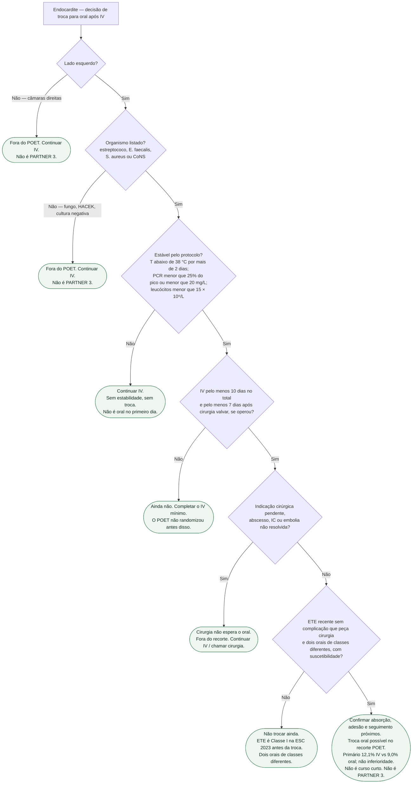

# Fluxograma: troca para oral após o POET

Pergunta desta árvore: **neste paciente com endocardite, o recorte do POET (PMID 30152252) autoriza completar o curso por via oral?** Folhas verdes são condutas. Um pai por nó. Folhas duplicadas quando o ramo cai fora do ensaio. Não inventar tempo de internamento. Não é o PARTNER 3 (PMID 30883058). Não é ensaio de encurtar o curso.

O POET (Iversen, *N Engl J Med*. 2019;380:415-424; NCT01375257) randomizou **400** adultos **já estáveis**, endocardite de **esquerda**, por estreptococo, *Enterococcus faecalis*, *S. aureus* ou coagulase-negativo: IV (**199**) versus oral (**201**). IV pelo menos **10 dias**; se operou, pelo menos **7 dias** de IV após a valva. Primário (morte, cirurgia não planejada, embolia ou recaída de bacteremia, da randomização até 6 meses após o fim do antibiótico): **24/199 (12,1%)** vs **18/201 (9,0%)**; diferença **3,1** pp; IC95% **−3,4 a 9,6**; P=**0,40**. Margem de não inferioridade **10** pp — cumprida. Restante após a randomização: mediana **19** vs **17** dias (IIQ 14–25; P=0,48). Troca de **via**, não curso curto.

## Árvore de decisão

## Como ler cada folha

**C1 e C2 — fora do recorte (folhas duplicadas, um pai cada).** Endocardite exclusivamente direita, fungo, HACEK e cultura negativa ficam fora da população-alvo. Infecção direita concomitante à esquerda não foi exclusão automática. Definir tratamento específico, sem extrapolar o POET. PMID **30883058** é o PARTNER 3 (TAVI no baixo risco) — vizinho no NEJM 2019, **não** é o POET.

**C3 — instável.** Protocolo: temperatura abaixo de **38,0 °C** por mais de **2 dias**; PCR **menor que 25%** do pico **ou** **menor que 20 mg/L**; leucócitos **menor que 15 × 10⁹/L**. Sem isso, a via continua intravenosa.

**C4 — IV mínimo ainda não cumprido.** Pelo menos **10 dias** de IV; se operou, pelo menos **7 dias** depois da valva. Oral no primeiro dia **não** é o ensaio.

**C5 — cirurgia pendente.** **152/400 (38%)** já operados **antes** da randomização. Prótese prévia em **107 (27%)**. Abscesso, IC, vegetação que pede cirurgia: a valva não espera o comprimido.

**C6 — ETE e dois orais.** ESC 2023 (PMID **37622656**): ETE **Classe I** antes de passar de IV para oral. Dois orais de **classes diferentes**, suscetibilidade em mão — não “qualquer comprimido”.

**C7 — recorte cumprido.** Antes da alta, confirmar absorção gastrointestinal, adesão, suporte e seguimento frequente; o protocolo excluiu absorção reduzida suspeita e baixa adesão. Não inferioridade: **12,1%** versus **9,0%**. Troca para oral / OPAT em selecionados, ESC 2023: **IIa A** — classe da diretriz, não desfecho do ensaio. Restante do curso semelhante (mediana **17–19** dias). Não transformar C7 em “duas semanas no total”. Internamento após a randomização **não** foi desfecho pré-especificado: esta árvore **não** recita tempo de permanência e **não** inventa dias de alta.

## O que a árvore não mostra

Doses: abrir o apêndice do POET e as tabelas da ESC 2023. POET II (encurtar o curso) é a porta de duração — não fundir. Seguimento de 5 anos (PMID 35139280) é extensão da **mesma** população selecionada.

## Tudo com Tudo

- [Duke modificado não é o POET](/biblioteca/duke-modificado-nao-e-poet)
- [Duração de antibiótico na endocardite: o que os ensaios recentes mostram](/biblioteca/duracao-de-antibiotico-na-endocardite-o-que-ensaios-recentes-mostram)
- [ESC 2023 de endocardite: o que ainda é Classe I em 2026](/biblioteca/esc-2023-endocardite-o-que-ainda-e-classe-i-em-2026)
- [POET: oral após estabilização — o que o ensaio não é](/biblioteca/poet-oral-apos-estabilizacao-o-que-o-ensaio-nao-e)
