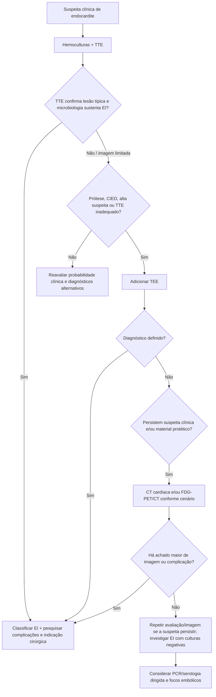
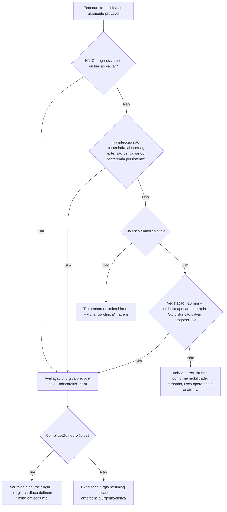

# JCS 2026 — endocardite infecciosa

A diretriz **JCS 2026** incorpora formalmente a evolução dos critérios Duke-ISCVID e consolida uma abordagem de **imagem multimodal** para endocardite infecciosa (EI), especialmente quando ecocardiografia isolada é insuficiente em próteses, dispositivos ou extensão perivalvar.

## 1. Diagnóstico não termina no primeiro ecocardiograma

A avaliação inicial continua baseada em:

- probabilidade clínica;
- hemoculturas antes do antibiótico quando isso não atrasar cuidado urgente;
- TTE como imagem inicial;
- TEE quando TTE é insuficiente ou a suspeita permanece relevante.

Um exame inicial negativo **não exclui EI** quando a probabilidade pré-teste permanece alta.

## 2. O que os critérios Duke-ISCVID acrescentam

A diretriz destaca três grupos de critérios maiores:

1. **microbiológicos**;
2. **imagem**;
3. **cirúrgicos**, quando há evidência direta de EI durante cirurgia.

Entre as ampliações diagnósticas relevantes estão:

- CT cardíaca como modalidade capaz de demonstrar vegetação, perfuração, aneurisma, abscesso, pseudoaneurisma, fístula ou deiscência protética;
- **FDG-PET/CT** com captação metabólica anormal envolvendo valva nativa, prótese ou outro material cardíaco protético;
- métodos moleculares específicos em endocardite de hemocultura negativa, incluindo PCR para agentes selecionados.

## 3. Quando usar CT e PET/CT

A JCS 2026 recomenda **whole-body CT em pacientes sintomáticos com EI nativa ou protética** para pesquisar embolização e outros critérios diagnósticos menores (**Classe I, nível B**).

**FDG-PET/CT deve ser considerado** quando EI é suspeita, particularmente em prótese ou dispositivo, mas o diagnóstico não foi estabelecido pelos outros métodos:

- Classe **IIa**;
- nível **A** para prótese/CIED;
- nível **C** para valva nativa.

Se o diagnóstico permanecer incerto e a modalidade estiver disponível, cintilografia com leucócitos marcados/SPECT-CT também pode ser considerada (**IIa C**).

## Árvore de diagnóstico multimodal

## 4. Três razões principais para cirurgia precoce

A diretriz resume a indicação cirúrgica aguda em três eixos:

1. **insuficiência cardíaca progressiva** por disfunção valvar;
2. **infecção não controlada**;
3. **alto risco embólico**.

Quando uma dessas condições está presente, prolongar observação sem reavaliar cirurgia pode perder a janela ideal.

A JCS categoriza timing aproximadamente como:

- **emergência:** dentro de 24 h após início do tratamento antimicrobiano;
- **urgente:** dentro de vários dias;
- **eletiva:** aproximadamente 1–2 semanas.

O timing real depende da indicação, estabilidade, complicações neurológicas e discussão pelo Endocarditis Team.

## 5. Vegetação e prevenção de embolia

A diretriz recomenda cirurgia precoce para:

- vegetação persistente **>10 mm** ou crescente com pelo menos um evento embólico apesar de antimicrobiano apropriado (**Classe I, B**);
- vegetação móvel **>10 mm** associada a disfunção valvar progressiva (**Classe I, B**).

Em vegetação móvel >10 mm sem outra indicação cirúrgica e com baixo risco operatório, cirurgia precoce **pode ser considerada** (**IIb C**).

## Árvore de decisão cirúrgica

## 6. Antes de encerrar o tratamento

Ao fim do tratamento antimicrobiano, a diretriz recomenda estabelecer **ecocardiograma basal para seguimento**, porque disfunção valvar pode persistir ou progredir mesmo após cura microbiológica.

Também é essencial orientar o paciente sobre:

- risco de recorrência;
- sinais como febre inexplicada;
- higiene oral e cutânea;
- evitar uso indiscriminado de antibiótico antes de coleta de culturas;
- necessidade de profilaxia quando pertencente a grupo de alto risco e submetido a procedimento indicado.

## Armadilhas

- Encerrar investigação após TTE negativo em prótese valvar.
- Tratar PET/CT como exame de rastreamento universal em qualquer suspeita baixa.
- Esperar vegetação atingir tamanho extremo antes de discutir cirurgia quando já existe IC ou infecção não controlada.
- Ignorar abscesso ou extensão perivalvar diante de novo bloqueio de condução.
- Usar um único tamanho de vegetação como decisão cirúrgica sem contexto embólico e valvar.
- Considerar fim do antibiótico como fim do seguimento cardíaco.

## Regra prática

**Na EI moderna, a sequência é probabilidade clínica + microbiologia + eco; se isso não resolve, ampliar para TEE/CT/PET conforme o contexto. A cirurgia deve ser pensada cedo sempre que houver IC, infecção não controlada ou alto risco embólico.**