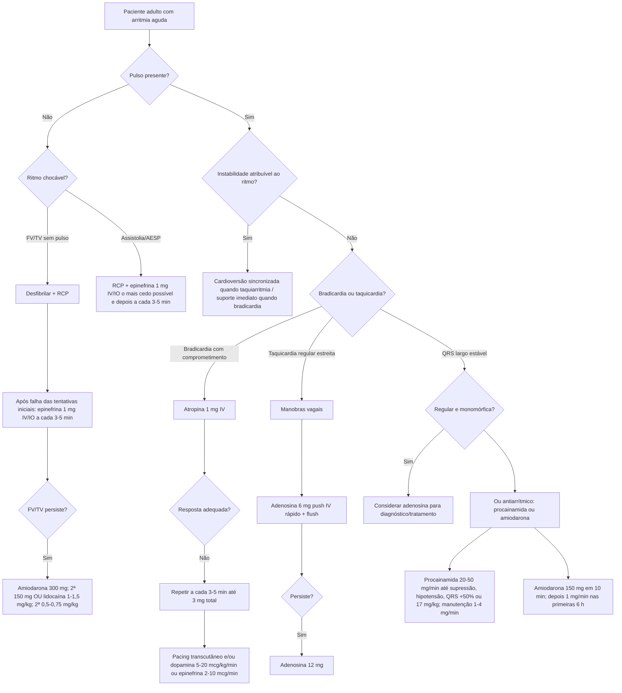

# ACLS 2025 — doses cardiológicas e árvore de decisão

Este documento organiza as doses que foram incorporadas às calculadoras interativas da Corvia. Ele **não substitui o algoritmo de ressuscitação**: a primeira decisão continua sendo reconhecer se há parada, instabilidade hemodinâmica ou um ritmo com pulso estável.

## Árvore central

## Doses incorporadas

### Parada cardíaca adulta

- **Epinefrina:** 1 mg IV/IO a cada 3–5 minutos.
- **Amiodarona em FV/TV sem pulso refratária:** 300 mg IV/IO em bolus; segunda dose 150 mg.
- **Lidocaína como alternativa:** primeira dose 1–1,5 mg/kg IV/IO; segunda dose 0,5–0,75 mg/kg.

A AHA 2025 recomenda epinefrina precocemente nos ritmos não chocáveis. Em FV/TV sem pulso, as tentativas iniciais de desfibrilação permanecem prioritárias.

### Bradicardia sintomática

- **Atropina:** 1 mg IV em bolus, repetir a cada 3–5 minutos; máximo total 3 mg.
- Se ineficaz: **dopamina 5–20 mcg/kg/min** e/ou **epinefrina 2–10 mcg/min**, além de pacing conforme o contexto.

A diferença de unidade é crítica: no algoritmo de bradicardia, epinefrina é expressa em **mcg/min**, enquanto vários esquemas de choque utilizam mcg/kg/min. A calculadora específica da Corvia mantém essas situações separadas para reduzir erro de unidade.

### Taquicardia regular

- **Adenosina:** 6 mg em push IV rápido + flush; se necessário, 12 mg.
- Em QRS largo, só considerar adenosina quando o paciente estiver estável e o ritmo for **regular e monomórfico**.
- Não administrar adenosina em taquicardia de QRS largo instável, irregularmente irregular ou polimórfica.

### TV monomórfica/QRS largo estável

**Procainamida:**
- 20–50 mg/min;
- interromper se a arritmia for suprimida, surgir hipotensão, QRS aumentar >50% ou atingir 17 mg/kg;
- manutenção 1–4 mg/min;
- evitar em QT prolongado ou insuficiência cardíaca congestiva.

**Amiodarona:**
- 150 mg IV em 10 minutos;
- pode repetir se a TV recorrer;
- depois 1 mg/min nas primeiras 6 horas.

## Armadilhas que a calculadora deve impedir

1. **Paciente instável:** não atrasar cardioversão para tentar sucessivas drogas.
2. **Adenosina e QRS largo:** não usar em ritmo irregular/polimórfico ou instável.
3. **Mistura de antiarrítmicos:** procainamida, amiodarona e outros antiarrítmicos não devem ser empilhados empiricamente; a combinação pode ser pró-arrítmica.
4. **Asma:** a AHA 2025 considera adenosina contraindicada pelo risco de broncoespasmo grave.
5. **Transplante cardíaco/acesso central:** doses muito menores de adenosina podem produzir efeito intenso; a diretriz cita que 1 mg IV pode ser suficiente em alguns desses pacientes.

## Referência principal

Wigginton JG, Agarwal S, Bartos JA, et al. *Part 9: Advanced Life Support: 2025 American Heart Association Guidelines for Cardiopulmonary Resuscitation and Emergency Cardiovascular Care*. Circulation. 2025;152(Suppl 2):S538-S577. DOI: **10.1161/CIR.0000000000001376**.
