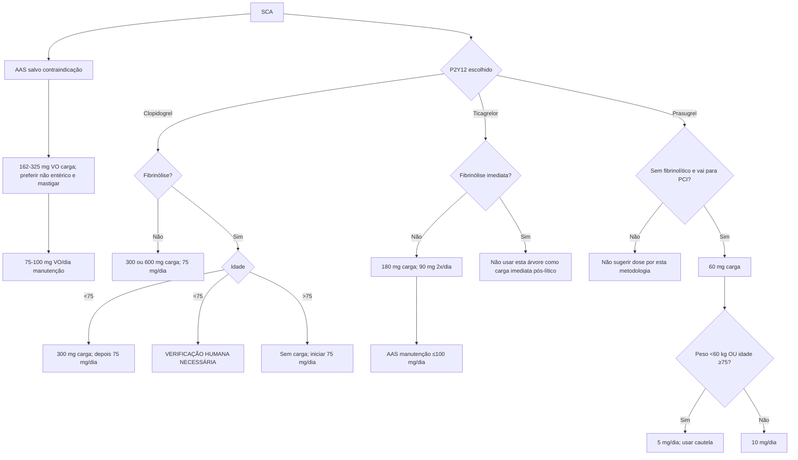

# Antiagregantes orais na SCA — árvore de dose

## AAS

- carga: **162–325 mg VO**;
- preferir formulação não entérica e mastigar quando possível para início mais rápido;
- manutenção: **75–100 mg/dia**.

A diretriz orienta administrar carga mesmo ao paciente que já usava AAS.

## Clopidogrel

### SCA sem fibrinólise
- carga: **300 ou 600 mg VO**;
- manutenção: **75 mg/dia**.

### STEMI com fibrinólise
A diretriz de 2025 contém uma inconsistência textual no ponto de corte de 75 anos:

- a **Tabela 7** diz: carga de 300 mg se idade **≤75 anos** e dose inicial de 75 mg se >75;
- o texto de suporte diz: carga de 300 mg se **<75 anos** e início sem carga, 75 mg/dia, se **≥75 anos**.

Por isso a implementação da Corvia faz:

- idade <75 anos: **300 mg de carga**, depois 75 mg/dia;
- idade >75 anos: **sem carga**, iniciar 75 mg/dia;
- idade **exatamente 75 anos**: `VERIFICAÇÃO HUMANA NECESSÁRIA`.

Essa decisão é deliberada: não se escolhe arbitrariamente entre duas frases conflitantes da mesma diretriz.

## Ticagrelor

Na SCA **sem fibrinolítico**:

- carga **180 mg VO**;
- manutenção **90 mg duas vezes ao dia**.

Quando ticagrelor é usado, a diretriz recomenda AAS de manutenção **≤100 mg/dia**.

A diretriz também discute transição para ticagrelor após fibrinólise em situações selecionadas; essa situação não foi transformada em “carga imediata no momento do lítico” na calculadora.

## Prasugrel

No cenário da Tabela 7 — SCA sem fibrinolítico e paciente submetido a PCI:

- carga **60 mg VO**;
- manutenção **10 mg/dia** se peso ≥60 kg e idade <75 anos;
- manutenção **5 mg/dia** se peso <60 kg ou idade ≥75 anos, com cautela.

## Limites da árvore

A escolha do P2Y12 depende de muito mais que a dose: história de AVC/AIT, risco hemorrágico, necessidade de anticoagulação, possibilidade de cirurgia, anatomia coronariana, interações e estratégia invasiva. Esses fatores precisam de avaliação clínica separada.

## Fonte

Rao SV, O'Donoghue ML, Ruel M, et al. 2025 ACC/AHA/ACEP/NAEMSP/SCAI Guideline for the Management of Patients With Acute Coronary Syndromes. J Am Coll Cardiol. 2025. DOI **10.1016/j.jacc.2024.11.009**.
