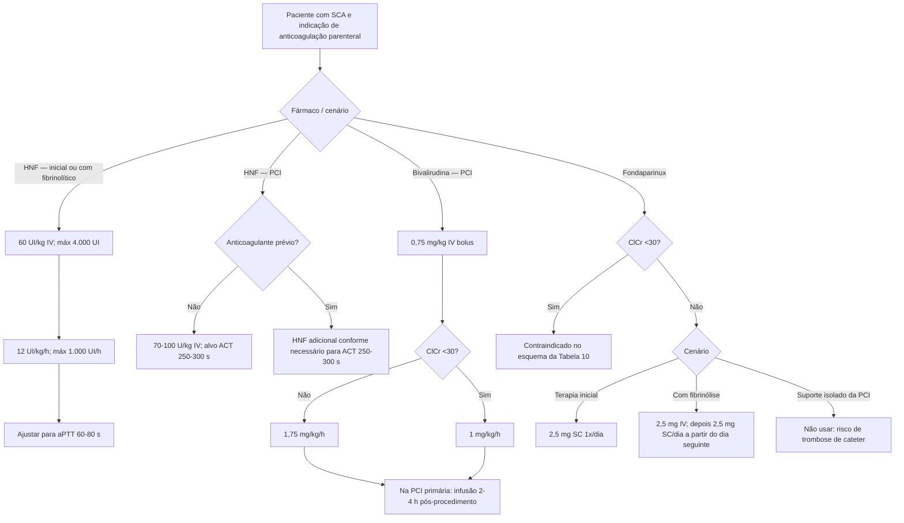

# Anticoagulação parenteral na SCA — árvore de dose

## Heparina não fracionada

### Terapia inicial da SCA ou associada a fibrinólise
- bolus **60 UI/kg IV**, máximo **4.000 UI**;
- infusão inicial **12 UI/kg/h**, máximo **1.000 UI/h**;
- ajustar para **aPTT 60–80 segundos**.

### Suporte da PCI

Se o paciente **não recebeu anticoagulante antes da PCI**:
- **70–100 U/kg IV**;
- alvo ACT **250–300 s**.

Se já recebeu anticoagulação, a diretriz não fornece um bolus fixo universal: administrar HNF adicional conforme necessário para atingir o ACT alvo. A calculadora deliberadamente não inventa um número nesse cenário.

## Bivalirudina

- bolus **0,75 mg/kg IV**;
- infusão **1,75 mg/kg/h** durante a PCI;
- se **ClCr <30 mL/min**, reduzir a infusão para **1 mg/kg/h**;
- a Tabela 10 descreve, na PCI primária, manutenção da infusão por **2–4 horas** após o procedimento.

## Fondaparinux

### Terapia inicial
- **2,5 mg SC uma vez ao dia**.

### Associado à fibrinólise
- **2,5 mg IV** inicialmente;
- **2,5 mg SC uma vez ao dia** a partir do dia seguinte.

### Função renal
- **ClCr <30 mL/min:** contraindicado no esquema da Tabela 10 ACC/AHA 2025.

### PCI
Fondaparinux **não deve ser usado isoladamente para suporte da PCI** devido ao risco de trombose de cateter. A calculadora bloqueia esse ramo em vez de fornecer 2,5 mg e deixar a impressão de que a anticoagulação da PCI está coberta.

## Enoxaparina

A enoxaparina tem árvore própria na Corvia porque idade, função renal, fibrinólise e tempo desde a última dose SC criam múltiplos ramos. Use o documento **“Enoxaparina na SCA — árvore de dose por idade, função renal e ICP”**.

## Fonte

Rao SV, O'Donoghue ML, Ruel M, et al. 2025 ACC/AHA/ACEP/NAEMSP/SCAI Guideline for the Management of Patients With Acute Coronary Syndromes. J Am Coll Cardiol. 2025. DOI **10.1016/j.jacc.2024.11.009**.
