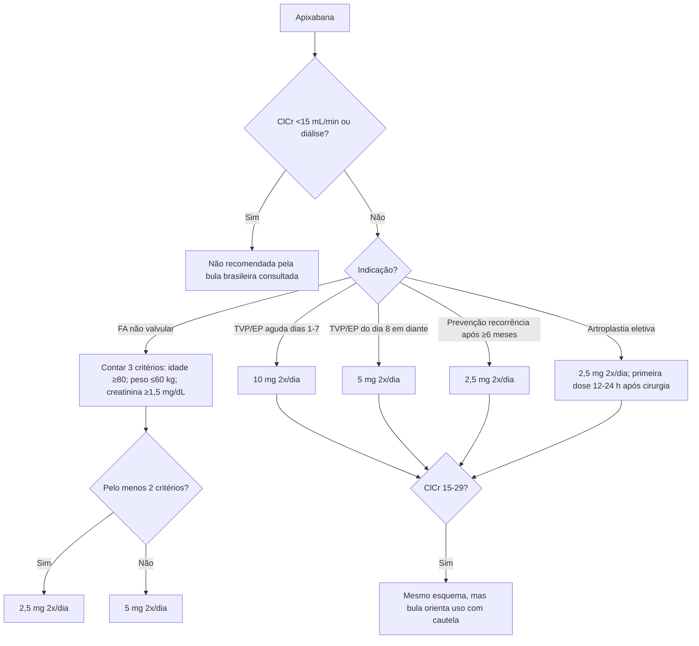
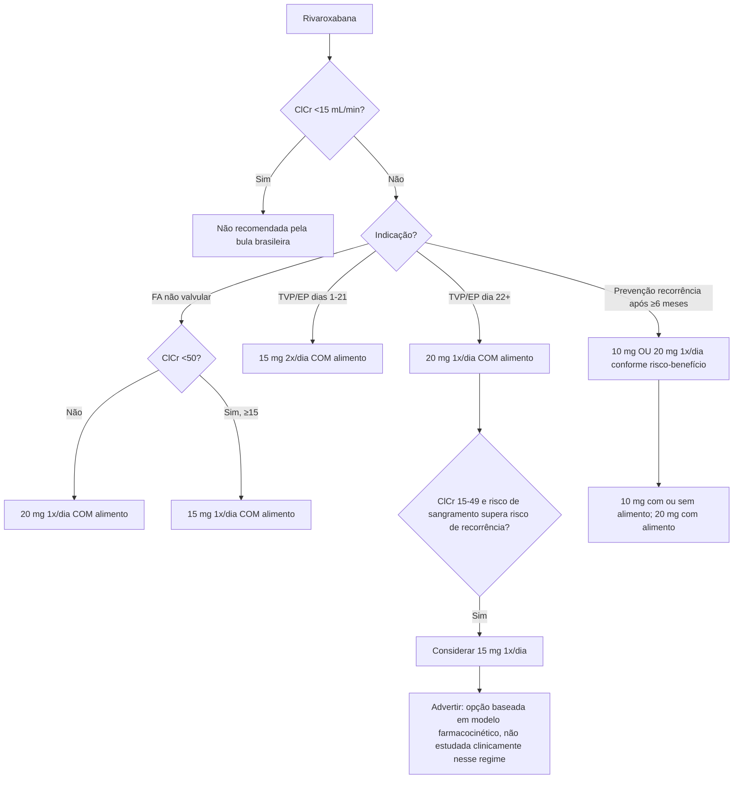

# Apixabana e rivaroxabana — seleção de dose pela bula brasileira 2025

A dose dos anticoagulantes orais diretos não deve ser escolhida apenas pelo nome do fármaco. **Indicação, fase do tratamento e função renal mudam o esquema**, e os critérios de redução da apixabana na fibrilação atrial não são intercambiáveis com os da rivaroxabana.

## Árvore de decisão — apixabana

### Regra dos “2 de 3” na FA

A bula brasileira consultada recomenda **5 mg duas vezes ao dia** na fibrilação atrial não valvular. Reduzir para **2,5 mg duas vezes ao dia** apenas quando estiverem presentes pelo menos **2** dos seguintes critérios:

- idade ≥80 anos;
- peso corporal ≤60 kg;
- creatinina sérica ≥1,5 mg/dL.

Ter somente um dos três critérios **não produz redução automática**.

### TEV com apixabana

- Dias 1–7: **10 mg duas vezes ao dia**.
- Depois: **5 mg duas vezes ao dia**.
- Após pelo menos 6 meses, prevenção de recorrência: **2,5 mg duas vezes ao dia**.
- ClCr 15–29 mL/min: a bula mantém esses esquemas, com uso cauteloso.
- ClCr <15 mL/min ou diálise: não recomendado pela bula brasileira consultada.

## Árvore de decisão — rivaroxabana

### FA não valvular com rivaroxabana

- Função renal preservada/ClCr ≥50 mL/min: **20 mg uma vez ao dia com alimento**.
- ClCr 15–49 mL/min: **15 mg uma vez ao dia com alimento**.
- ClCr 15–29 mL/min: dados clínicos limitados; usar com cautela.
- ClCr <15 mL/min: não recomendado.

### TVP/EP com rivaroxabana

**Dias 1–21:** 15 mg duas vezes ao dia, inclusive quando ClCr está entre 15 e 49 mL/min; em ClCr 15–29, usar com cautela.

**Dia 22 em diante:** dose usual 20 mg uma vez ao dia. Na insuficiência renal moderada/grave (ClCr 15–49 mL/min), a bula profissional permite **considerar 15 mg uma vez ao dia se o risco de sangramento avaliado superar o risco de recorrência de TVP/EP**. A própria bula ressalta que essa recomendação de 15 mg é baseada em **modelo farmacocinético e não foi estudada nesse cenário clínico**.

**Após pelo menos 6 meses:** 10 mg ou 20 mg uma vez ao dia conforme avaliação individual do risco de recorrência versus sangramento.

## Armadilhas que a calculadora evita

1. **Aplicar “2 de 3” da apixabana à rivaroxabana:** incorreto.
2. **Reduzir apixabana por idade isolada:** a bula exige pelo menos 2 critérios na FA.
3. **Reduzir rivaroxabana para 15 mg/dia automaticamente em todo TEV com ClCr <50:** incorreto após o dia 21; a redução é apenas uma consideração condicional e possui a ressalva farmacocinética.
4. **Esquecer alimento:** rivaroxabana 15 e 20 mg devem ser tomadas com alimento; a apresentação de 10 mg pode ser tomada com ou sem alimento.
5. **Usar DOAC com ClCr <15 mL/min como se fosse respaldado pelas bulas brasileiras consultadas:** ambas as bulas aqui utilizadas não recomendam uso nesse cenário.

## Fontes consultadas

- **Eliquis®/apixabana:** bula profissional Pfizer Brasil, revisão de **22 de outubro de 2025**.
- **Xarelto®/rivaroxabana:** Bulário Bayer, versão profissional aprovada pela **Anvisa em 22 de dezembro de 2025**.

Este material descreve **posologia de bula** e não decide se o anticoagulante é indicado. Próteses mecânicas, estenose mitral reumática significativa, síndrome antifosfolípide, gravidez, sangramento ativo, doença hepática e interações relevantes exigem avaliação clínica específica.
