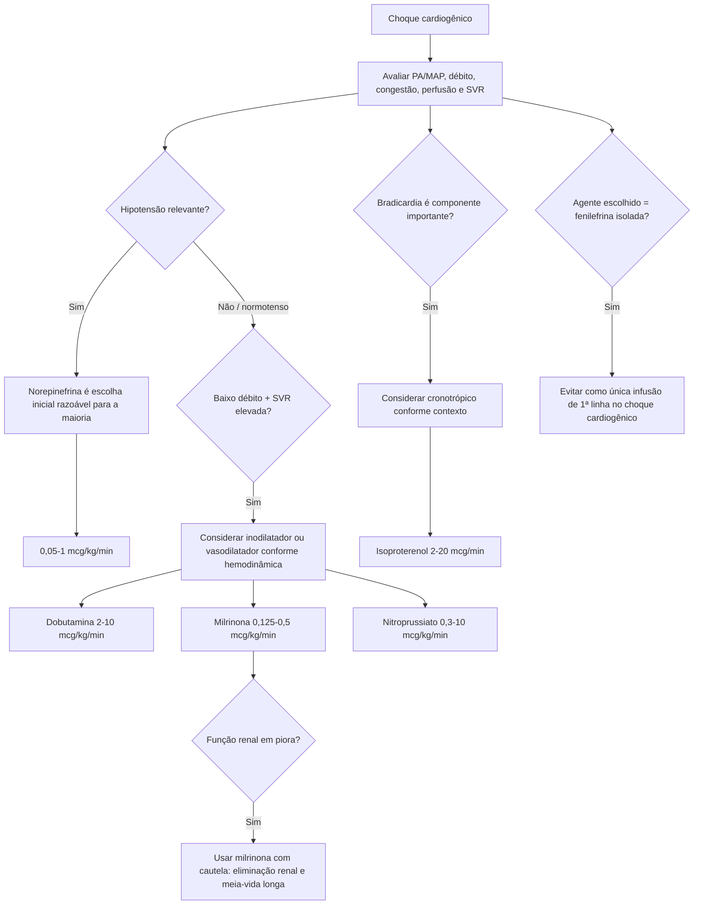

# Choque cardiogênico — vasoativos ACC 2025 e árvore de dose

O consenso ACC 2025 não define um único vasoativo ideal para todo choque cardiogênico. A seleção deve responder ao **fenótipo hemodinâmico** e usar a menor dose capaz de sustentar perfusão pelo menor tempo possível.

## Faixas da Tabela 2 ACC 2025

| Agente | Classe | Faixa |
|---|---|---:|
| Norepinefrina | inopressor | 0,05–1 mcg/kg/min |
| Epinefrina | inopressor | 0,01–0,5 mcg/kg/min |
| Dopamina | inopressor/cronotrópico | 2–20 mcg/kg/min |
| Dobutamina | inodilatador | 2–10 mcg/kg/min |
| Milrinona | inodilatador | 0,125–0,5 mcg/kg/min |
| Fenilefrina | vasopressor puro | 0,1–10 mcg/kg/min |
| Vasopressina | vasopressor | 0,01–0,04 U/min |
| Nitroprussiato | vasodilatador | 0,3–10 mcg/kg/min |
| Nitroglicerina | vasodilatador | 25–200 mcg/min |
| Isoproterenol | cronotrópico | 2–20 mcg/min |

A calculadora converte a dose selecionada em **mL/h** a partir da quantidade do fármaco e do volume preparado, preservando a unidade correta de cada agente.

## Regras práticas do consenso

### Hipotensão

Embora não exista consenso definitivo de primeira linha sustentado por desfecho de mortalidade, o grupo ACC considera a **norepinefrina uma escolha inicial razoável para a maioria dos pacientes com choque cardiogênico hipotensivo**.

### Inodilatadores

Dobutamina e milrinona aumentam débito e reduzem pós-carga. Podem ser úteis em fenótipo normotenso, especialmente quando a SVR está elevada, mas podem agravar hipotensão.

A **milrinona** deve ser usada com cuidado na piora renal devido à eliminação renal e meia-vida relativamente longa.

### Fenilefrina

O consenso **desencoraja fortemente fenilefrina como única infusão IV de primeira linha** no choque cardiogênico, porque o aumento isolado de resistência vascular pode reduzir débito e provocar bradicardia reflexa.

### Menor dose e menor tempo

Catecolaminas e outros vasoativos podem causar arritmia e aumentar consumo miocárdico de oxigênio. A orientação é usar **a menor dose possível pelo menor período necessário**, com reavaliação seriada e escalada para suporte mecânico quando o paciente permanece refratário.

## Fonte

Sinha SS, Morrow DA, Kapur NK, Kataria R, Roswell RO. 2025 Concise Clinical Guidance: An ACC Expert Consensus Statement on the Evaluation and Management of Cardiogenic Shock. *J Am Coll Cardiol*. 2025;85(16):1618–1641. DOI **10.1016/j.jacc.2025.02.018**.
