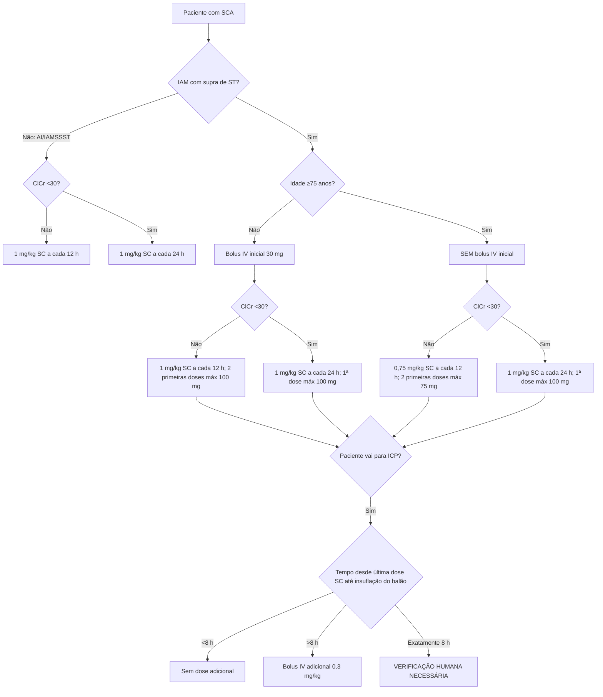

# Enoxaparina na SCA — árvore de dose

O regime de enoxaparina no IAM com supra não pode ser resumido a “1 mg/kg 12/12 h”. A bula brasileira consultada cria quatro ramos pela combinação **idade <75 versus ≥75 anos** e **ClCr ≥30 versus <30 mL/min**.

## Angina instável / IAM sem supra

- Dose padrão: **1 mg/kg SC a cada 12 horas**.
- ClCr <30 mL/min: **1 mg/kg SC uma vez ao dia**.
- A bula consultada orienta uso concomitante com AAS oral 100–325 mg/dia e descreve duração usual de 2–8 dias.

## IAM com supra — idade <75 anos

### ClCr ≥30 mL/min
- bolus IV único: **30 mg**;
- imediatamente acompanhado de **1 mg/kg SC**;
- depois 1 mg/kg SC a cada 12 h;
- as **duas primeiras doses SC** têm máximo de **100 mg cada**.

### ClCr <30 mL/min
- bolus IV único: **30 mg**;
- 1 mg/kg SC;
- depois 1 mg/kg SC **uma vez ao dia**;
- a **primeira dose SC** tem máximo de **100 mg**.

## IAM com supra — idade ≥75 anos

A mudança mais importante é: **não administrar o bolus IV inicial de 30 mg**.

### ClCr ≥30 mL/min
- **0,75 mg/kg SC a cada 12 h**;
- máximo **75 mg** em cada uma das duas primeiras doses;
- doses posteriores 0,75 mg/kg.

### ClCr <30 mL/min
- **1 mg/kg SC uma vez ao dia**;
- sem bolus IV inicial;
- primeira dose SC máximo **100 mg**.

## Dose adicional na ICP

Segundo a bula consultada:

- se a última dose SC ocorreu **há menos de 8 horas** antes da insuflação do balão: **não é necessária dose adicional**;
- se ocorreu **há mais de 8 horas**: administrar **0,3 mg/kg IV**;
- o texto não explicita a situação de **exatamente 8 horas**. A calculadora retorna `VERIFICAÇÃO HUMANA NECESSÁRIA` nesse valor, evitando escolher arbitrariamente um dos ramos.

## Segurança

A calculadora não incorpora, por si só, risco hemorrágico global, história de HIT, plaquetopenia, anestesia neuraxial, peso extremo ou necessidade de monitorização anti-Xa. Em ClCr 30–50 mL/min a bula não determina redução de dose, mas recomenda monitorização clínica cuidadosa.

## Fonte

Clexane® (enoxaparina sódica), Sanofi Medley Farmacêutica Ltda., registro MS 1.8326.0336, bula identificada como IB100619 e aprovada pela Anvisa em **10/06/2019**. A Anvisa aprovou posteriormente, em fevereiro de 2025, nova indicação de tratamento estendido de TEV em câncer ativo; essa atualização não foi utilizada para alterar os esquemas de SCA descritos neste documento.
